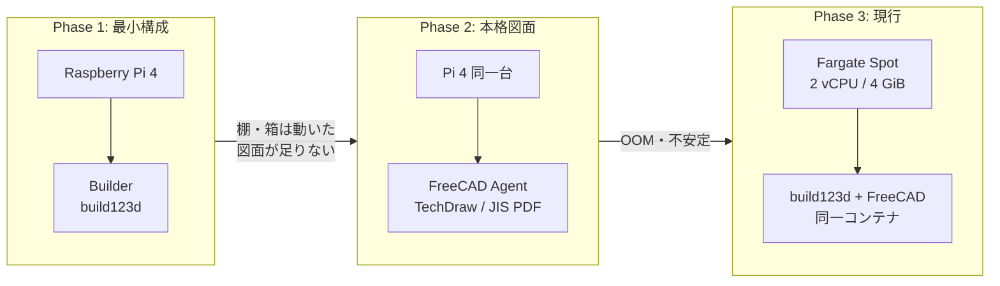
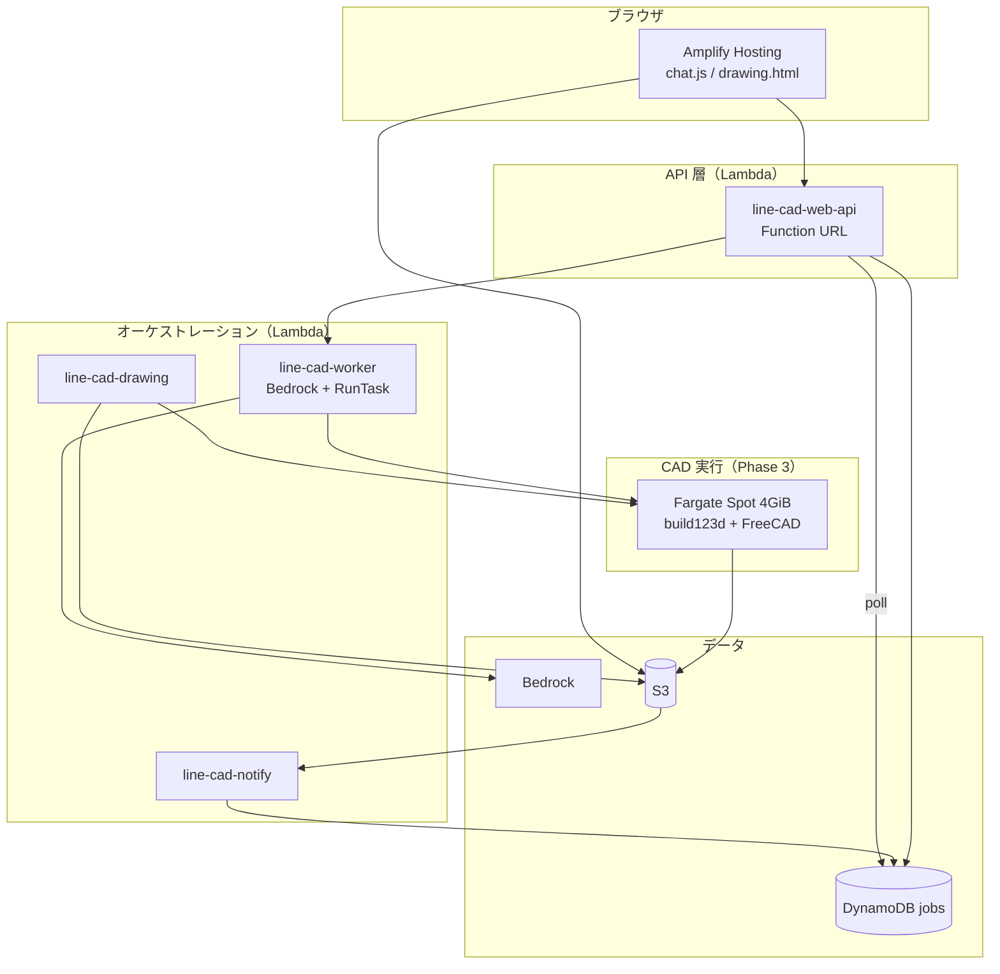
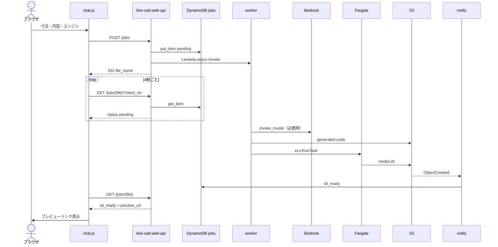

## はじめに

DIY で家具を作るとき、いちばんしんどいのは「頭の中の形」を CAD に落とす作業だと感じています。そこで **DIY CAD** を作りました。

ブラウザのチャット UI から「壁に付ける本棚、幅30×奥行20×高さ40cm」と入力すると、

1. **3D モデル（STL）** が生成される
2. プレビューで OK すれば **寸法付き図面（SVG / PDF）** が開ける
3. 気に入らなければ **修正点を伝えて再生成** できる

いまの入口は **Web（AWS Amplify）** です。この記事では、AWS 側の構成とあわせて、**CAD の実行環境が Pi 4 → FreeCAD → Fargate と段階的に変わった経緯** を中心に書きます。

- デモ: `https://main.dvhn99ddh1wj.amplifyapp.com/`
- リポジトリ: [GitHub — DIY_Agent](https://github.com/usudonsdev/DIY_Agent)

---

## CAD 実行基盤の進化

最初から Fargate にはしていません。**要求が増えるたびに実行環境を一段ずつ上げた** のがこのプロジェクトの軌跡です。



### Phase 1 — Raspberry Pi 4 + Builder（build123d）

**目的:** 個人開発の予算で **「入力 → Bedrock → STL」** の最短経路を通す。

| 項目 | 内容 |
|------|------|
| ハード | **Raspberry Pi 4**（自宅常時起動） |
| CAD | **Builder** — Python の [build123d](https://build123d.readthedocs.io/) で STL 生成 |
| 連携 | Lambda Worker → **AWS IoT Core** → Pi が MQTT 購読 → S3 に `*.stl` を put |
| 得意なこと | 棚・箱・ペン立てなど **単純な直方体系** |
| 弱いところ | **JIS 風の本格図面**（寸法線・複数ビュー・PDF）は build123d だけでは厳しい |

クラウドは **Lambda（軽いオーケストレーション）+ Bedrock（コード生成）+ S3（成果物）** に寄せ、**重いメッシュ生成だけ Pi** に逃がしました。いわゆる **エッジコンピューティング** で、月額を抑えながら MVP を回す構成です。

```
ユーザー → Lambda → Bedrock → IoT publish
  → Pi 4: build123d 実行 → S3: model.stl
```

### Phase 2 — FreeCAD を追加（複雑な図面へ）

**きっかけ:** プレビュー用 STL だけでは不十分で、**寸法付き図面（PDF/DXF）** が North Star に入ってきた。

| 項目 | 内容 |
|------|------|
| CAD | **FreeCAD** + TechDraw + JIS 風エクスポート |
| 構成 | Pi 上に **別プロセス**（`freecad_agent.py`）を追加 |
| IoT | トピックを分離 — `device/cad/request`（build123d）/ `device/cad/freecad/request` |
| ユーザー体験 | 同じ Bot から **build123d（軽量）/ FreeCAD（本格）** を選択 |

FreeCAD は **ヘッドレス + Xvfb + TechDraw + PDF 変換（rsvg）** と、build123d より桁違いに重いです。図面品質は上がりましたが、**同じ Pi 4 で 2 系統を抱えるとメモリが厳しく**なりました。

実際に起きたこと:

- 複雑な本棚ジョブで **プロセスが OOM kill** される
- FreeCAD 起動だけで **数 GB 単位** の RAM を食う
- `rsvg-convert` や TechDraw まわりで **環境差・パッケージ不足** が出やすい（`librsvg2-bin` など）

「図面までちゃんと出す」フェーズに入った時点で、**Pi 4 は実行基盤として限界**が見え始めました。

### Phase 3 — Fargate Spot へ移行（現行）

**判断:** CAD 実行を **ジョブ単位の ECS Fargate Spot RunTask** に移し、Pi は検証用・レガシー（`CAD_BACKEND=iot`）に退避。

| 項目 | Pi 4 | Fargate（現行） |
|------|------|-----------------|
| メモリ | 4〜8 GiB を OS と共有 | **タスク 4 GiB 専有**（CPU 2 vCPU） |
| スケール | 1 台固定 | **ジョブごとにタスク起動 → 終了** |
| 課金 | 電気代 + 常時起動 | **使った分だけ**（Spot） |
| 環境 | 自宅で apt 地獄 | **Docker イメージで固定** |

```
Worker → S3: generated-code/*.json
      → ecs:RunTask（Fargate Spot）
      → コンテナ: build123d or FreeCAD
      → S3: *.stl / drawings/*.pdf
      → タスク終了
```

コンテナは `line-cad-bot/fargate/Dockerfile`（Ubuntu + FreeCAD + build123d 依存）。Pi で苦労した **`librsvg2-bin` 不足で PDF が崩れる** 問題も、イメージに焼き込んで解消しました。

**なぜ最初から Fargate しなかったか**

- MVP 段階では **パイプラインが通るか** が最優先で、手元の Pi 4 1 台が最も安かった
- build123d だけのときは **Pi で十分だった**
- FreeCAD と図面出力が必要になってから、クラウド側の実行コストを払う意味が出てきた

要求が具体化してから実行基盤を上げる、という順番にしています。

### 進化のまとめ（年表イメージ）

| 段階 | 実行環境 | トリガー | 得られたもの |
|------|----------|----------|--------------|
| v1 MVP | **Pi 4 + build123d** | コスト最小で STL まで | Bedrock → IoT → S3 の型 |
| v2 | **Pi 4 + FreeCAD 追加** | 本格図面・JIS PDF | エンジン二系統・承認フロー |
| v2.1 | **Fargate Spot** | **メモリ不足・OOM** | 安定した図面生成・Web 入口 |

Lambda / DynamoDB / S3 の **ジョブ非同期パターンは Phase 1 からほぼ不変**です。変えたのは主に **「誰が STL/PDF をレンダリングするか」** だけ。オーケストレーション層を先に固めたおかげで、Pi → Fargate の差し替えは Worker の dispatch 部分中心で済みました。

---

## なぜ LINE から Web へ（入口の進化）

CAD 実行基盤と別軸で、**ユーザー入口も段階的に変えています。**

| 観点 | LINE Bot（検証期） | Web（現行） |
|------|-------------------|-------------|
| 図面の表示 | 外部 URL をタップ | **同一サイト内ビューア** |
| 会話 UI | テキスト中心 | **チャット + クイックボタン** |
| 材料リスト・ affiliate | 載せにくい | **図面ページに拡張しやすい** |

Pi 時代は LINE が手軽でしたが、Fargate 本番と図面ビューアを見据え **Amplify + Function URL** に寄せています。

---

## 全体アーキテクチャ（v2.1.0・現行）

**重い処理は Fargate、軽い指揮は Lambda** — Phase 1 の Pi 時代から役割分担の思想は同じです。



> 破線の祖先: Phase 1〜2 では `ECS` の代わりに **Pi 4（IoT Core 経由）** が同じ S3 バケットに書き込んでいました。

図の詳細版: `docs/awsArchitecture/v2.1.0/`

### Lambda の役割（Web 視点）

| 関数 | Web での役割 |
|------|----------------|
| **`line-cad-web-api`** | **メイン入口**。ジョブ作成・ポーリング・承認・修正 |
| `line-cad-worker` | Bedrock + テンプレート + Fargate 起動 |
| `line-cad-notify` | S3 イベント → `jobs.status` 更新（Web は push なし） |
| `line-cad-drawing` | OK 後の図面生成 |
| `line-diy-cad-webhook` | （レガシー）LINE 用。Web フローでは未使用 |

Fat Lambda にまとめず、**入口（Web API）と重処理（Worker）を分離**しています。Function URL は最大 30 秒のため、Worker は必ず非同期 invoke です。

---

## Web フロント（Amplify）

静的サイトは `web/` を **Amplify Hosting** で配信。モノレポではリポジトリ直下 `amplify.yml` で `appRoot: web` を指定しています。

| ファイル | 役割 |
|----------|------|
| `index.html` + `chat.js` | 日本語の設計チャット（状態機械） |
| `drawing.html` + `drawing.js` | S3 上の SVG/PDF ビューア |
| `config.js` | `apiBaseUrl`（Function URL） |

### チャットの会話フロー（`chat.js`）

```
設計をはじめる
  → エンジン選択（build123d / FreeCAD）
  → 寸法 → 作りたいもの → 部屋の雰囲気
  → POST /jobs → ポーリング
  → stl_ready → プレビューリンク + OK / 修正
  → OK → POST /jobs/{file}/approve → 図面
  → 修正 → POST /jobs/{file}/revise → 再ポーリング
```

会話状態は **ブラウザ側**（`chat.js` の state + `localStorage` の `client_id`）で保持します。サーバーにセッションテーブルは不要で、ジョブは DynamoDB の `line-cad-jobs` のみです。

`user_id` は `web_{client_id}` 形式。同一ブラウザならジョブの所有者チェックに使います。

### CORS のハマりどころ

Function URL の CORS 設定と、Lambda レスポンスの `Access-Control-Allow-Origin` を **両方付けるとブラウザが `Failed to fetch`** になります。本番では Function URL 側の CORS のみに任せ、Lambda からは CORS ヘッダーを返さないようにしました。

---

## リクエストの流れ（初回生成）



**Web には LINE のような push がない**ため、完了検知はポーリングのみです。Notify Lambda は `web_*` ユーザーに対して LINE push をスキップし、**ジョブテーブル更新だけ**行います。

---

## Web API 設計（`line-cad-web-api`）

| メソッド | パス | 用途 |
|----------|------|------|
| POST | `/jobs` | 新規ジョブ作成 + Worker 起動 |
| GET | `/jobs/{file_name}?client_id=` | ステータス・プレビュー URL 取得 |
| POST | `/jobs/{file_name}/approve` | 図面生成トリガー |
| POST | `/jobs/{file_name}/revise` | 修正ジョブ作成 + Worker 起動 |

Function URL + `AuthType: NONE` のため、現状は **誰でも POST 可能**です。個人開発の段階ではシンプルさを優先し、将来 Cognito や API キーを足す余地を残しています。

---

## DynamoDB 設計

Web フローで使うのは **`line-cad-jobs` のみ**（`line-cad-sessions` は LINE レガシー用）。

| 属性 | 用途 |
|------|------|
| `file_name` (PK) | S3 の STL キーと 1:1 |
| `user_id` | `web_{uuid}` |
| `status` | pending → stl_ready → approved → drawing_ready |
| `revision_of` | 修正チェーン |
| `preview_url` / `drawing_url` | フロントへ返す URL |
| `ttl` | 30 日で自動削除 |

ジョブをファイル名キーにしたのは、**S3 イベントの object key とそのまま突合**できるためです。

---

## S3 のキー設計

| プレフィックス | 用途 |
|----------------|------|
| `*.stl`（ルート） | 3D モデル本体 |
| `generated-code/` | Worker 出力（修正時に再利用） |
| `drawings/web_{id}/` | build123d SVG |
| `drawings/` | FreeCAD PDF |

`drawing.html` は `?stl=...&user=web_{id}` で SVG を表示します。

---

## Bedrock の使い方

モデル: `jp.anthropic.claude-haiku-4-5-20251001-v1:0`（東京 CRIS）

| 用途 | 呼び出し元 |
|------|------------|
| 物体タイプ分類 | worker |
| CAD コード自由生成 | worker |
| 修正（前回コード + フィードバック） | worker |
| 図面 SVG フォールバック | drawing |

定番形状（棚・箱など）は **テンプレート優先**で Bedrock を呼ばず、コストとハルシネーションを抑えています。Phase 1 の Pi + build123d 時代から続く方針です。

---

## Fargate タスク設計（Pi からの引き継ぎ）

Pi で FreeCAD が落ちていたので、タスク定義は余裕を持たせています（`template.yaml`）。

| 設定 | 値 | 理由 |
|------|-----|------|
| CPU | 2048（2 vCPU） | FreeCAD + TechDraw |
| Memory | **4096 MiB** | Pi 4 OOM の再発防止 |
| 起動方式 | RunTask（ジョブ単位） | 常時起動コンテナより安い |
| Capacity | **Fargate Spot** | オンデマンドより単価を抑える |

コンテナ内のマクロは **Pi 時代の `raspberry-pi/freecad/` をそのまま Docker にコピー**しています。ロジックを捨てず、**実行場所だけクラウドに移した** のがポイントです。

SAM の `CadBackend` パラメータで `ecs` / `iot` を切り替え可能。本番は `ecs`、Pi はローカル検証用に残しています。

---

## IAM と予算ブレーキ

Bedrock を直接呼ぶロール:

- `line-cad-worker-role-*`
- `line-cad-bot-stack-DrawingFunctionRole-*`

個人開発の予算向けに **AWS Budgets + IAM Deny**（`bedrock:InvokeModel`）で、上限超過時に Bedrock 呼び出しを止める構成も入れています。

**注意:** 初回がテンプレートのみだと Bedrock なしで成功し、**修正時だけ Bedrock が必要**になることがあります。

---

## SAM（IaC）

`line-cad-bot/template.yaml` で管理:

- Web API / Notify / Drawing Lambda（SAM 管理ロール）
- ECS / ECR / 名前付き IAM ロール
- Worker / Receiver は既存ロール Retain（レガシー）

```bash
cd line-cad-bot
sam build --no-use-container
sam deploy   # CAPABILITY_IAM CAPABILITY_NAMED_IAM
```

Web 側は GitHub push → Amplify 自動デプロイ。`config.js` の `apiBaseUrl` に `WebApiFunctionUrl` を設定します。

---

## うまくいったこと / 反省

### うまくいったこと

- **Amplify + Function URL** でフロントと API を独立デプロイできた
- **ジョブテーブル + ポーリング**で、Web にもそのまま載る非同期パターンになった
- **同じ Worker / Drawing** を LINE 時代から流用し、バックエンドを作り直さず済んだ
- 図面ビューアを同一オリジンに置き、**North Star（材料リスト）** への拡張余地ができた

### 反省・今後

| 項目 | 内容 |
|------|------|
| API 認証 | Function URL 公開のまま → Cognito |
| ポーリング | WebSocket / SSE で UX 改善 |
| 材料リスト | `drawing.html` の次フェーズ |
| E2E テスト | チャットフローの自動テストが薄い |

---

## まとめ

DIY CAD は、次の 3 段階で育てました。

1. **Pi 4 + build123d** — 最小パイプライン（IoT → S3）
2. **FreeCAD 追加** — 本格図面。Pi 4 で OOM が発生
3. **Fargate Spot + Web** — 実行をコンテナに移し、入口を Amplify に

AWS 側は一貫して **Lambda（指揮）・ DynamoDB（ジョブ）・ S3（成果物）・ Bedrock（コード生成）** です。変えたのは主に **STL/PDF を誰がレンダリングするか** で、オーケストレーション層は Phase 1 からほぼそのままです。

テンプレートを優先して Bedrock コストを抑えつつ、足りない形状だけ AI に任せる。重い CAD だけエッジ（当時は Pi、いまは Fargate）に逃がす。この分担が、個人の予算と図面品質のバランスを取るうえで効いています。

---

## 参考リンク

- アーキテクチャ v2.1.0: `docs/awsArchitecture/v2.1.0/README.md`
- Web フロント: `web/README.md`
- IAM 設計: `docs/awsArchitecture/v2.1.0/iam-design.md`

---

## おわりに

最初から Fargate にせず、**Pi 4 で動かして、図面品質とメモリの壁でクラウド実行に移した** — 個人開発としては自然な移行だったと思います。

次は図面の寸法から **材料リストとホームセンター向けのカット指示** を、同じ Web 上に載せていく予定です。似たような構成を試している方の参考になれば幸いです。
