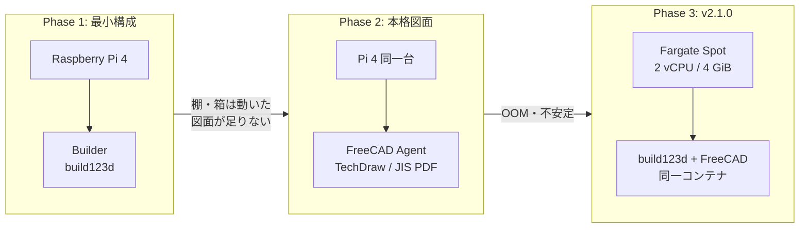
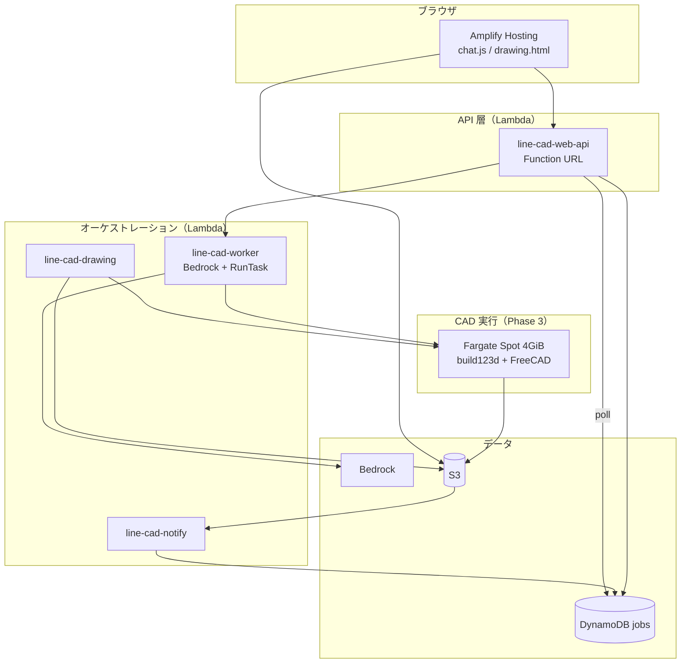
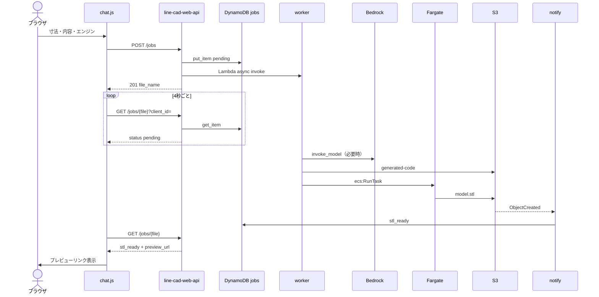
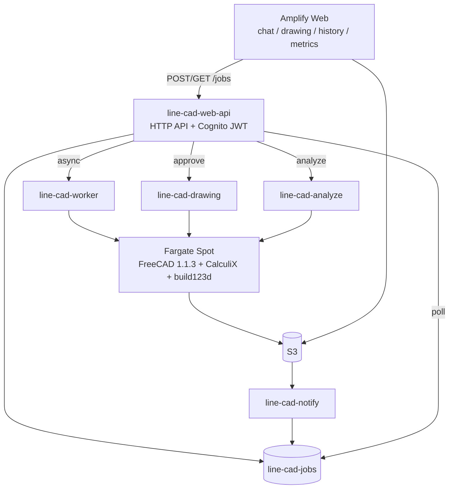

自宅の Raspberry Pi 4 で CAD を動かしていました。棚も箱もちゃんと生成できて、いい構成だと思っていました。

図面を出そうとした瞬間に壊れました。

FreeCAD を足したら、起動するだけで数 GB の RAM を持っていかれ、複雑な本棚のジョブでプロセスが OOM kill される。図面品質を上げようとするほど落ちる。この記事は、そこから CAD の実行環境を **Raspberry Pi → Fargate** に引っ越し、ついでにユーザー入口を **LINE → Web** に移すまでの記録です。

作っているのは **DIY-Agent** — ブラウザのチャットに「壁に付ける本棚、幅30×奥行20×高さ40cm」と打つと、3D モデル（STL）と寸法付き図面（SVG / PDF）が返ってくるサービスです。

- デモ: [DIY-Agent](https://main.dvhn99ddh1wj.amplifyapp.com/)
- リポジトリ: [usudonsdev/DIY_Agent](https://github.com/usudonsdev/DIY_Agent)

読みどころは 2 つあります。**Pi から Fargate への移行が Worker の一部分だけで済んだ理由**（「引っ越しが 1 箇所で済んだ理由」）と、**解析が完全に失敗しているのに「安全です」と返していた話**（「応力 0.0 は『安全』ではなく『壊れている』」）です。

> この記事は v2.1.0（2026-08-07 執筆）を軸に、その後の v2.2.0 までを時系列で追記しています。見出しに時点を入れてあるので、どのバージョンの話かはそこで判断してください。
>
> **追記（2026-09）: 現行はすべての生成を FreeCAD 経路に統一し、build123d 経路は休止しています。** 本文中の「エンジン二系統」「エンジン選択」は v2.2.0 時点の記述です。一本化の理由は末尾の「エンジンを FreeCAD に一本化した（2026-09）」に書きました。

---

## 3 回引っ越した CAD 実行環境

先に全体像を出します。このプロジェクトで一番動いたのは、アプリのロジックではなく **CAD を実際に走らせる場所** でした。


```mermaid
flowchart LR
    subgraph P1["Phase 1: 最小構成"]
        Pi1[Raspberry Pi 4]
        BLD[Builder<br/>build123d]
        Pi1 --> BLD
    end

    subgraph P2["Phase 2: 本格図面"]
        Pi2[Pi 4 同一台]
        FC[FreeCAD Agent<br/>TechDraw / JIS PDF]
        Pi2 --> FC
    end

    subgraph P3["Phase 3: v2.1.0"]
        ECS[Fargate Spot<br/>2 vCPU / 4 GiB]
        BLD2[build123d + FreeCAD<br/>同一コンテナ]
        ECS --> BLD2
    end

    P1 -->|棚・箱は動いた<br/>図面が足りない| P2
    P2 -->|OOM・不安定| P3
```

| 段階 | 実行環境 | 引っ越しの引き金 | 得られたもの |
|------|----------|----------|--------------|
| v1.0 | Pi 4 + build123d | コスト最小で STL まで | Bedrock → IoT → S3 の型 |
| v2.0 | Pi 4 + FreeCAD 追加 | 本格図面・JIS PDF が要る | エンジン二系統・承認フロー |
| v2.1.0 | Fargate Spot | **メモリ不足・OOM** | 安定した図面生成・Web 入口 |
| v2.2.0 | Fargate（FreeCAD 1.1.3） | 強度チェックの追加 | CAE・Cognito 認証 |

※ この表は v2.2.0 までの履歴です。現行では build123d 経路を休止し、FreeCAD に一本化しています（末尾に追記）。

一方で、**Lambda（指揮）・DynamoDB（ジョブ）・S3（成果物）・Bedrock（コード生成）という骨格は Phase 1 から一度も変えていません。** 変わったのは「誰が STL と PDF をレンダリングするか」だけです。この非対称が、この記事で一番言いたいことです。

---

## Phase 1 — Raspberry Pi 4 で始めた（v1.0）

目的は単純で、個人開発の予算で「入力 → Bedrock → STL」の最短経路を通すことでした。

CAD 本体は Python の [build123d](https://build123d.readthedocs.io/) で、自宅で常時起動している Raspberry Pi 4 の上で動かします。クラウド側は Lambda が指揮を執り、Bedrock が build123d のコードを書き、生成したコードを **AWS IoT Core 経由の MQTT** で Pi に飛ばす。Pi は STL を作って S3 に置く。

```
ユーザー → Lambda → Bedrock → IoT publish
  → Pi 4: build123d 実行 → S3: model.stl
```

重いメッシュ生成だけをエッジに逃がし、クラウドには軽いオーケストレーションだけ置く。棚・箱・ペン立てのような単純な直方体系はこれで十分に動きました。

弱点も最初から見えていました。**JIS 風の本格図面（寸法線・複数ビュー・PDF）は build123d だけでは厳しい。** ただしこの時点では図面は要件に入っていなかったので、見ないことにしました。

---

## Phase 2 — 図面が欲しくなって、Pi が悲鳴を上げた（v2.0）

プレビュー用の STL だけでは物足りなくなり、**寸法付き図面（PDF / DXF）** が North Star に入ってきます。build123d では届かないので、FreeCAD + TechDraw を足しました。

同じ Pi の上に `freecad_agent.py` を別プロセスとして立て、IoT のトピックを分けます（`device/cad/request` が build123d、`device/cad/freecad/request` が FreeCAD）。ユーザーは同じ Bot から「軽量」か「本格」かを選べる。設計としては素直でした。

問題は、FreeCAD が build123d より桁違いに重かったことです。ヘッドレス起動に Xvfb が要り、TechDraw で図面を組み、rsvg で PDF に変換する。実際に起きたのは次の 3 つです。

- 複雑な本棚ジョブで **プロセスが OOM kill される**
- FreeCAD は起動するだけで **数 GB 単位** の RAM を食う
- `rsvg-convert` や TechDraw まわりで環境差・パッケージ不足が出る（`librsvg2-bin` など）

4〜8 GiB を OS と共有している Pi 4 に、build123d と FreeCAD の 2 系統を同居させるのは無理がありました。**図面品質を上げようとするほど落ちる**、という一番つらい壊れ方です。

「図面までちゃんと出す」フェーズに入った時点で、Pi 4 は実行基盤として限界でした。

---

## Phase 3 — Fargate Spot に引っ越す（v2.1.0）

CAD 実行を **ジョブ単位の ECS Fargate Spot RunTask** に移しました。

```
Worker → S3: generated-code/*.json
      → ecs:RunTask（Fargate Spot）
      → コンテナ: build123d or FreeCAD
      → S3: *.stl / drawings/*.pdf
      → タスク終了
```

| 項目 | Pi 4 | Fargate（v2.1.0） |
|------|------|-----------------|
| メモリ | 4〜8 GiB を OS と共有 | タスク 4 GiB 専有（2 vCPU） |
| スケール | 1 台固定 | ジョブごとに起動 → 終了 |
| 課金 | 電気代 + 常時起動 | 使った分だけ（Spot） |
| 環境 | 自宅で apt 地獄 | Docker イメージで固定 |

Pi で悩まされた「`librsvg2-bin` が無くて PDF が崩れる」も、イメージに焼き込んだ時点で消えました。環境差というバグの温床が、Dockerfile 1 枚に置き換わっています。

### 引っ越しが 1 箇所で済んだ理由

この移行で一番よかったのは、**変更範囲が Worker の dispatch 部分にほぼ収まった** ことでした。

Phase 1 の時点で、ジョブは DynamoDB に積み、成果物は S3 に置き、完成は S3 イベントで検知する、という非同期パターンを作ってあります。Worker から見ると「CAD コードをどこかに投げる」という 1 行があるだけで、その先が **IoT publish なのか `ecs:RunTask` なのか**は関心の外でした。

だから差し替えは、その 1 行の分岐を増やすだけで済みます。SAM の `CadBackend` パラメータで `ecs` / `iot` を切り替えられるようにして、本番は `ecs`、Pi はローカル検証用に残しました。

さらに、**Pi 時代の `raspberry-pi/freecad/` のマクロは、そのまま Docker イメージにコピーしています。** 苦労して書いた TechDraw まわりのロジックを捨てず、実行場所だけをクラウドに移した形です。

インフラを差し替えるときにコードまで書き直すことになったら、それは移行ではなく作り直しです。オーケストレーション層を先に固めておくと、実行基盤は消耗品として扱えるようになる — これが Pi で 2 回転んだ見返りでした。

### なぜ最初から Fargate にしなかったか

こう書くと「最初から Fargate にしておけば」と思われそうですが、順番としてはこれでよかったと思っています。

MVP 段階で最優先だったのは、パイプラインが通るかどうかでした。その検証に、手元の Pi 4 一台より安い選択肢はありません。build123d だけを回していた頃は、性能的にも Pi で足りていました。クラウドの実行コストを払う意味が出てきたのは、FreeCAD と図面出力が必要になってからです。

要求が具体化してから実行基盤を上げる。逆に言えば、**要求が具体化するまでは上げない**。

### タスク定義

Pi で落ちていた記憶があるので、タスク定義には余裕を持たせています（`template.yaml`）。

| 設定 | 値 | 理由 |
|------|-----|------|
| CPU | 2048（2 vCPU） | FreeCAD + TechDraw |
| Memory | 4096 MiB | Pi 4 OOM の再発防止 |
| 起動方式 | RunTask（ジョブ単位） | 常時起動コンテナより安い |
| Capacity | Fargate Spot | オンデマンドより単価を抑える |

---

## 入口を LINE から Web へ（v2.1.0）

CAD 実行基盤とは別の軸で、ユーザー入口も動かしました。

| 観点 | LINE Bot（検証期） | Web（v2.1.0） |
|------|-------------------|-------------|
| 図面の表示 | 外部 URL をタップ | 同一サイト内ビューア |
| 会話 UI | テキスト中心 | チャット + クイックボタン |
| 材料リストへの拡張 | 載せにくい | 図面ページに足せる |

Pi 時代は LINE が最も手軽でした。ただ、図面ビューアを自前で持ちたくなった時点で、LINE の中に閉じている理由がなくなります。図面を同一オリジンに置ければ、その先の材料リストやカット指示まで同じページに乗せられる。

### v2.1.0 の全体像


```mermaid
flowchart TB
    subgraph Client["ブラウザ"]
        WEB[Amplify Hosting<br/>chat.js / drawing.html]
    end

    subgraph API["API 層（Lambda）"]
        FURL[line-cad-web-api<br/>Function URL]
    end

    subgraph Core["オーケストレーション（Lambda）"]
        WRK[line-cad-worker<br/>Bedrock + RunTask]
        NTF[line-cad-notify]
        DRW[line-cad-drawing]
    end

    subgraph CAD["CAD 実行（Phase 3）"]
        ECS[Fargate Spot 4GiB<br/>build123d + FreeCAD]
    end

    subgraph Data["データ"]
        BR[Bedrock]
        DDB[(DynamoDB jobs)]
        S3[(S3)]
    end

    WEB --> FURL
    FURL --> DDB
    FURL --> WRK
    WRK --> BR
    WRK --> ECS
    ECS --> S3
    S3 --> NTF
    NTF --> DDB
    FURL -->|poll| DDB
    DRW --> ECS
    DRW --> S3
    WEB --> S3
```

Phase 1〜2 では、この図の `ECS` の位置に **Pi 4（IoT Core 経由）** が入っていました。同じ S3 バケットに書き込む、同じ役割です。

Lambda は 5 本。入口の `line-cad-web-api` がジョブ作成・ポーリング・承認・修正を受け、`line-cad-worker` が Bedrock とテンプレートで CAD コードを作って Fargate を起動、`line-cad-notify` が S3 イベントでジョブの status を更新し、`line-cad-drawing` が承認後の図面を作ります。`line-diy-cad-webhook` は LINE 用のレガシーで、Web フローでは使いません。

Fat Lambda にまとめず、入口（Web API）と重処理（Worker）を分けています。入口は応答を短く保ちたいので、Worker は必ず非同期 invoke です。

### 完了検知はポーリングしかない

Web には LINE のような push がありません。ここが移行で一番割を食った部分です。


```mermaid
sequenceDiagram
    actor U as ブラウザ
    participant UI as chat.js
    participant API as line-cad-web-api
    participant D as DynamoDB jobs
    participant W as worker
    participant B as Bedrock
    participant E as Fargate
    participant S as S3
    participant N as notify

    U->>UI: 寸法・内容・エンジン
    UI->>API: POST /jobs
    API->>D: put_item pending
    API->>W: Lambda async invoke
    API-->>UI: 201 file_name
    loop 4秒ごと
        UI->>API: GET /jobs/{file}?client_id=
        API->>D: get_item
        API-->>UI: status pending
    end
    W->>B: invoke_model（必要時）
    W->>S: generated-code
    W->>E: ecs:RunTask
    E->>S: model.stl
    S-->>N: ObjectCreated
    N->>D: stl_ready
    UI->>API: GET /jobs/{file}
    API-->>UI: stl_ready + preview_url
    UI->>U: プレビューリンク表示
```

Notify Lambda は `web_*` ユーザーに対しては LINE push をスキップし、ジョブテーブルの更新だけを行います。LINE 時代のコードをそのまま残しつつ、通知先だけ分岐させた形です。

### フロントと、CORS で溶かした半日

静的サイトは `web/` を Amplify Hosting で配信します。モノレポなので、リポジトリ直下の `amplify.yml` で `appRoot: web` を指定しています。中身は `index.html` + `chat.js`（日本語の設計チャット、状態機械）、`drawing.html` + `drawing.js`（S3 上の SVG/PDF ビューア）、`config.js`（API のベース URL）だけです。

会話フローはこうなっています。

```
設計をはじめる
  → エンジン選択（build123d / FreeCAD）  ※現行では廃止、FreeCAD 固定
  → 寸法 → 作りたいもの → 部屋の雰囲気
  → POST /jobs → ポーリング
  → stl_ready → プレビューリンク + OK / 修正
  → OK → POST /jobs/{file}/approve → 図面
  → 修正 → POST /jobs/{file}/revise → 再ポーリング
```

会話状態はブラウザ側（`chat.js` の state + `localStorage` の `client_id`）に置いています。サーバーにセッションテーブルは要らず、ジョブは DynamoDB の `line-cad-jobs` だけ。`user_id` は `web_{client_id}` 形式で、この時点では認証がないので「同一ブラウザであること」を所有者チェックの代わりにしていました。

そして、ここで半日溶かしたのが CORS です。

**Function URL 側の CORS 設定と、Lambda レスポンスの `Access-Control-Allow-Origin` を両方付けると、ブラウザは `Failed to fetch` になります。** ヘッダーが重複するとプリフライトが通りません。エラーメッセージからは「CORS が足りない」ようにしか見えないので、足す方向にデバッグしてしまうのが罠でした。正解は減らす方で、Function URL 側の CORS だけに任せ、Lambda からは CORS ヘッダーを返さないようにしています。

この教訓は、後述の API Gateway 移行後もそのまま生きています。二重に付けると壊れるのは同じです。

---

## 認証なしで Bedrock を公開していた（v2.2.0）

v2.1.0 の Web API は **Function URL + `AuthType: NONE`**、つまり誰でも POST できる状態でした。当時は「個人開発だしシンプルさを優先」と書いて先送りしています。Bedrock を呼ぶエンドポイントを認証なしで公開しているので、正直に言えば時間の問題でした。

v2.2.0 で **API Gateway HTTP API + Cognito JWT Authorizer** に移しました。**この記事の前半に出てくる Function URL は、現行では存在しません。**

| 項目 | v2.1.0 | v2.2.0 |
|---|---|---|
| API 入口 | Lambda Function URL（`AuthType: NONE`） | API Gateway HTTP API |
| 認証 | なし | Cognito User Pool `diy-cad-web-users` |
| ログイン | — | Google IdP + メール（Hosted UI, Authorization Code + PKCE） |
| `user_id` | `web_{client_id}`（localStorage の UUID） | `web_{Cognito sub}` |

フロントは `web/auth.js` で PKCE フローを回します。ビルドステップを増やしたくなかったので、素の IIFE で書いて `chat.js` から `window.DiyCadAuth.getIdToken()` を呼ぶだけにしました。Amplify に載せている静的サイトの性格を崩さずに認証を足せたのは、結果的によかった点です。

`user_id` が `web_{client_id}` から `web_{sub}` に変わったことで、**ジョブが端末ではなくアカウントに紐づく**ようになりました。これが履歴画面の前提になっています。

---

## 応力 0.0 は「安全」ではなく「壊れている」（v2.2.0）

v2.2.0 の目玉は **CAE — 作った家具が使う前に壊れないかの簡易チェック**でした。この記事で一番危なかったのがここです。

### まず、CalculiX が何も返さない

`line-cad-analyze` という Lambda を足し、Fargate 上で FreeCAD の FEM を回す計画でした。当初の見積もりは「イメージに既に `freecad` が入っているので、`calculix-ccx` と `gmsh` を足すだけ」。

実機で動かすと、CalculiX が**全要素で `nonpositive jacobian` を出して結果を一切返しません**。

形状が悪いのかと思い、400×100×20 の単純な直方体まで落として切り分けました。原因は形状でもジョブ生成でもなく、**FreeCAD 0.19 と gmsh 4.8 の間で 2 次要素メッシュの受け渡しが壊れている**ことでした。

| ElementOrder | 節点数 / 要素数 | 節点/要素比 | CalculiX |
|---|---|---|---|
| 2nd（既定） | 2019 / 92 | **21.9**（健全なら約 1.5） | 結果ゼロ |
| 1st | 355 / 154 | 2.3 | 結果は出るが変位 1.2e12 mm |

節点/要素比 21.9 が答えです。節点が要素間で共有されておらず、メッシュがバラバラの破片になっていました。Netgen で代替しようにも、0.19 ビルドには組み込まれていません。

結局 **FreeCAD 本体を apt 版 0.19 から公式 AppImage 1.1.3 に差し替え**ました。同じテストで節点/要素比 2.0、CalculiX も正常終了します。イメージサイズは増えましたが、既存の STL・TechDraw PDF/DXF 生成は同じイメージで回帰確認済みで、支配的コストである Bedrock 料金には影響しません。

### 解析の失敗を「応力 0.0」として返していた

FreeCAD のバージョン問題より深刻なバグが、自分のコードの側にありました。

CalculiX が結果を返さないと `von_mises` が空リストになります。そこに、こういうフォールバックが書いてありました。

```python
max_stress = max(von_mises) if von_mises else 0.0
```

**解析が完全に失敗しているのに、「応力 0.0」つまり「十分な余裕あり」と判定して返していた** わけです。

強度チェックを名乗るプロダクトとして、これ以上ない最悪の失敗モードです。ユーザーには「安全です」と表示され、実際には何も計算されていない。しかも例外は出ないので、ログを見ても気づけません。

修正は単純で、**結果が空なら必ず例外を投げて `verdict: "error"` を返す**ようにしました。教訓としては、`if ... else 0.0` のような「安全側に見える初期値」は、ドメインによっては安全側ではないということです。0 は「応力が無い」ではなく「測れていない」でした。

あわせて、`Part::MultiFuse`（`Refine=True`）が体積の負な（向きが反転した）ソリッドを返すバグも直しています。底面が「上向きの面」と誤検出される原因でもありました。

### 浮いた部品を、プロンプトではなく検証で止める

v2.1.0 までは、部品が空中に浮いたままの STL が普通に通っていました。LINE 時代から「かごが変な板の集合体になる」という症状で出ていたやつです。

これまではプロンプトで対処していました。「存在しない API を使うな」「部品はつなげろ」と書き、失敗例を few-shot で足す。ただ、LLM は指示を守らないことがあります。

v2.2.0 では **生成結果を検証する側に回しました。** 単一の連結ソリッドになっているかを確認し、近接するソリッドは自動接続を試み、それでも不合格なら Bedrock に再生成させる。

「テンプレートを優先して LLM の出番を減らす」というこのプロジェクトの方針の延長ですが、**残った LLM 生成の品質を、プロンプトではなく検証で担保する**という一段になっています。プロンプトはお願いですが、検証は保証です。


### 生成フローを直列に変えた

v2.2.0 では STL 生成・図面生成・強度チェックを互いに順序依存のない 3 本の枝と
して並列に置いていました。現行では直列のフローに変更し、3D モデルのプレビュー
を確認 → 強度チェックを実行 → 結果を見て再生成するか承認して図面に進むか、と
いう順にしています。

変更した一番の理由は、チャットが会話として成立しなくなることでした。並列に走
らせると結果が順不同で返り、ユーザーから見ると「いま何に答えればいいのか」が
分からなくなります。会話は片方が投げて片方が返すという順序があるから成立する
ものなので、並列処理はこの形式と相性が悪い。

もう 1 つは、並列のままだと強度チェックの結果が出る前に図面まで作れてしまう点
です。成果物として図面が手元にある状態で「実は強度が足りなかった」と分かるの
は、順序として逆でした。

処理としては並列にできても、判断の順序としては直列であるべき場面がある、とい
うのがこの変更で得た整理です。

### v2.2.0 の全体像


```mermaid
flowchart TB
    WEB[Amplify Web<br/>chat / drawing / history / metrics]
    HAPI[line-cad-web-api<br/>HTTP API + Cognito JWT]
    WRK[line-cad-worker]
    DRW[line-cad-drawing]
    ANL[line-cad-analyze]
    NTF[line-cad-notify]
    ECS[Fargate Spot<br/>FreeCAD 1.1.3 + CalculiX + build123d]
    DDB[(line-cad-jobs)]
    S3[(S3)]

    WEB -->|POST/GET /jobs| HAPI
    HAPI --> DDB
    HAPI -->|async| WRK
    HAPI -->|approve| DRW
    HAPI -->|analyze| ANL
    WRK --> ECS
    DRW --> ECS
    ANL --> ECS
    ECS --> S3
    S3 --> NTF
    NTF --> DDB
    HAPI -->|poll| DDB
    WEB --> S3
```

STL 生成 / 図面生成 / 強度チェックは **並列の 3 本の枝**で、互いの順序に依存しません（ただし図面と強度チェックは `stl_ready` 以降でないと受け付けません）。

Web 画面も増えました。チャットと図面ビューアに加えて、履歴（`history.html`）・メトリクス（`metrics.html`）・同意 UI。LINE Bot 自体は `diy-cad/archive/line-bot/` にアーカイブし、`line-diy-cad-webhook` は 410 を返すスタブになっています。ユーザー入口は Web だけになりました。

Pi 経路（`CAD_BACKEND=iot`）は、いまも切り替え可能なまま残してあります。

---

## 設計リファレンス

ここから先は読み飛ばしても筋は通ります。各レイヤの具体的な設計です。

### ジョブテーブル（`line-cad-jobs`）

| 属性 | 用途 |
|------|------|
| `file_name` (PK) | S3 の STL キーと 1:1 |
| `user_id` | `web_{client_id}` → v2.2.0 で `web_{Cognito sub}` |
| `status` | pending → stl_ready → approved → drawing_ready |
| `revision_of` | 修正チェーン |
| `preview_url` / `drawing_url` | フロントへ返す URL |
| `ttl` | 30 日で自動削除 |

**パーティションキーをファイル名にしたのが効きました。** 完成検知は S3 の ObjectCreated イベントで行うので、イベントに入っている object key をそのままキーにして `update_item` できます。ジョブ ID を別に振っていたら、key からジョブを逆引きするインデックスが要りました。

v2.2.0 では `cae_*` 属性と `failed` ステータス（`error_message` 付き）が加わっています。v2.1.0 では失敗が無言の停止になることがあり、ユーザーが「作成中」のまま待たされていました。

status の遷移は現行だとこうです。

```text
pending
  → stl_ready ─┬─ approved → drawing_requested → drawing_ready
               └─ analysis_requested → analysis_ready
  → failed（どの段階でも。error_message に理由）
```

### S3 のキー設計

| プレフィックス | 用途 |
|----------------|------|
| `*.stl`（ルート） | 3D モデル本体 |
| `generated-code/` | Worker 出力（修正時に再利用） |
| `drawings/web_{id}/` | build123d SVG |
| `drawings/` | FreeCAD PDF |

v2.2.0 で `analysis/` が加わりました。`drawing.html` は `?stl=...&user=web_{id}` で SVG を表示します。

### Bedrock の使い方

モデルは `jp.anthropic.claude-haiku-4-5-20251001-v1:0`（東京 CRIS）。用途は物体タイプの分類、CAD コードの自由生成、修正（前回コード + フィードバック）、図面 SVG のフォールバックの 4 つで、前 3 つが worker、最後が drawing からの呼び出しです。v2.2.0 では CAE のシナリオ推論が加わりました。

棚や箱のような定番形状は **テンプレート優先**で、Bedrock を呼びません。コストとハルシネーションを同時に抑えられるので、Phase 1 の Pi + build123d 時代からずっとこの方針です。

### Web API

v2.1.0 では 4 本でした。現行は 7 本です。

| メソッド | パス | 用途 | 追加 |
|---|---|---|---|
| POST | `/jobs` | 新規ジョブ作成 + Worker 起動 | |
| GET | `/jobs` | サインイン中ユーザーのジョブ一覧（履歴画面） | v2.2.0 |
| GET | `/jobs/{file_name}` | ステータス・プレビュー URL 取得 | |
| POST | `/jobs/{file_name}/approve` | 図面生成トリガー | |
| POST | `/jobs/{file_name}/revise` | 修正ジョブ作成 + Worker 起動 | |
| POST | `/jobs/{file_name}/analyze` | 強度チェック（CAE）トリガー | v2.2.0 |
| GET | `/jobs/{file_name}/cut-list` | 材料リスト / カット寸法 | v2.2.0 |

v2.1.0 の `GET /jobs/{file}` にあった `?client_id=` は、Cognito 移行で不要になりました。所有者判定は JWT の `sub` で行います。

### IAM と予算ブレーキ

Bedrock を直接呼ぶロールは `line-cad-worker-role-*` と `line-cad-bot-stack-DrawingFunctionRole-*` の 2 つです。個人開発の予算向けに、**AWS Budgets + IAM Deny**（`bedrock:InvokeModel`）で上限超過時に Bedrock 呼び出しを止める構成を入れています。

注意点が 1 つあって、**初回生成がテンプレートだけで済むと Bedrock なしで成功し、修正のときだけ Bedrock が必要になる**ことがあります。「さっきは動いたのに修正だけ失敗する」という切り分けにくい症状になるので、Deny が付いていないかを最初に疑うようにしています。

### SAM

`diy-cad/template.yaml` で管理しています。Web API / Notify / Drawing Lambda（SAM 管理ロール）、ECS / ECR / 名前付き IAM ロール、そして Worker / Receiver は既存ロールを Retain（レガシー）。

```bash
cd diy-cad
sam build --no-use-container
sam deploy   # CAPABILITY_IAM CAPABILITY_NAMED_IAM
```

Web 側は GitHub push → Amplify 自動デプロイです。

---

## 学んだこと

最初のアーキテクチャ図を描いてから、ここまで約 2 か月。持ち帰ったものを 3 つに絞ります。

**1. オーケストレーション層を先に固めると、実行基盤は消耗品になる**

Pi → Fargate の引っ越しが Worker の dispatch だけで済んだのは、ジョブテーブルと S3 イベントによる非同期パターンを Phase 1 で作ってあったからです。逆に、ここが Lambda の中に溶けていたら、移行は作り直しになっていました。**変わりそうな部分（実行場所）と変わらない部分（ジョブの流れ）を最初に分けておく**、というだけの話ですが、効き方が大きい。

**2. 要求が具体化するまで、基盤は上げない**

最初から Fargate にしなかったのは正解でした。MVP で検証したかったのはパイプラインが通るかどうかで、そこに Pi 4 一台より安い選択肢はありません。図面が要求に入って初めて、クラウドの実行コストを払う意味が出てきます。

**3. プロンプトはお願い、検証は保証**

LLM に CAD コードを書かせる部分は、最初プロンプトで品質を担保しようとしていました。禁止 API を並べ、失敗例を few-shot で足す。それでも守られないことがあります。分類できる形状をテンプレートに逃がし、残りは生成結果を検証して不合格なら作り直させる、という形に落ち着きました。

そして、その検証自体がバグっていると「応力 0.0 = 安全」のような最悪の嘘をつきます。**チェック機構を足すときは、チェックが失敗したときに何を返すかを先に決めておく。** これが一番高くついた学びでした。

---

## エンジンを FreeCAD に一本化した（2026-09）

v2.2.0 までは build123d と FreeCAD の二系統を残し、ユーザーがチャットの最初にエンジンを選ぶ形にしていました。現行ではエンジン選択そのものを廃止し、**すべての生成を FreeCAD 経路に統一**しています。build123d 経路はコードとしては残していますが、通常フローからは外しました。

理由は 2 つあります。

### 失敗したときに、何が残っているかが違う

同じ Bedrock が書いたコードでも、二系統では壊れ方が違いました。

| | build123d | FreeCAD |
| --- | --- | --- |
| 実行単位 | スクリプト全体 | ドキュメントへの逐次操作 |
| 途中で失敗したとき | 何も残らない | 直前までのオブジェクトツリーが残る |
| 失敗後にできること | 全再生成 | 現在の状態を問い合わせて差分修正 |

build123d はスクリプトを 1 つの実行単位として回すので、途中の 1 行が落ちれば成果物はゼロです。一方 FreeCAD はドキュメントのオブジェクトツリーに逐次追加していくため、N 番目の操作で失敗しても N-1 番目までは実体として残り、「何が出来ていて何が出来ていないか」をそのまま問い合わせられます。

なお、これはテンプレート化の効果ではありません。テンプレートを使うのは棚・箱のような定番形状だけで、全体に占める割合はどちらの経路でも低く、大半は Bedrock の自由生成です。条件を揃えたうえで、失敗の局所性に差が出ています。

### Fargate は実行時間課金なので、全再生成が高くつく

CAD 実行は Fargate Spot の RunTask で、タスクの実行時間がそのまま課金対象です。失敗のたびに最初から作り直すと、成功していた部分の計算まで毎回払い直すことになります。残った状態を使って修正できる経路のほうが、設計としてもコストとしても有利でした。

「プロンプトはお願い、検証は保証」の次に来るのは、**検証で不合格を出したあとに何を返すか**です。いまは不合格なら Bedrock に全再生成させていますが、修正用の操作だけを生成して現在のドキュメントに適用する経路を検討しています。エンジンを一本化したのは、その前提を揃えるためでもあります。

---

## いま作っているもの

`docs/awsArchitecture/v3.0.0-mechanism/concept.md` として、**可動部を持つ機構**（ヒンジ・引き出し・駆動系）への拡張を進めています。

v2.2.0 で「単一の連結ソリッドを強制する」検証を入れたばかりなのに、機構をやるなら **部品が分かれたまま出力して可動範囲を検証する**経路が必要になります。せっかく作った制約を、自分で例外扱いしにいく段階です。メジャー更新にしているのはそのためです。

似た構成を試している方の参考になれば幸いです。

---

## 参考リンク

- リポジトリ: [usudonsdev/DIY_Agent](https://github.com/usudonsdev/DIY_Agent)
- アーキテクチャ v2.1.0（本記事の前半）: [docs/awsArchitecture/v2.1.0/README.md](https://github.com/usudonsdev/DIY_Agent/blob/master/docs/awsArchitecture/v2.1.0/README.md)
- アーキテクチャ v2.2.0: [docs/awsArchitecture/v2.2.0/README.md](https://github.com/usudonsdev/DIY_Agent/blob/master/docs/awsArchitecture/v2.2.0/README.md)
- CAE 設計: [docs/awsArchitecture/v2.2.0-cae/concept.md](https://github.com/usudonsdev/DIY_Agent/blob/master/docs/awsArchitecture/v2.2.0-cae/concept.md)
- Pi 4 → FreeCAD → Fargate の詳細: [docs/awsArchitecture/v2.1.0/cad-evolution.md](https://github.com/usudonsdev/DIY_Agent/blob/master/docs/awsArchitecture/v2.1.0/cad-evolution.md)
- IAM・予算ブレーキ: [docs/awsArchitecture/v2.1.0/iam-design.md](https://github.com/usudonsdev/DIY_Agent/blob/master/docs/awsArchitecture/v2.1.0/iam-design.md)
- Web フロント: [web/README.md](https://github.com/usudonsdev/DIY_Agent/blob/master/web/README.md)
