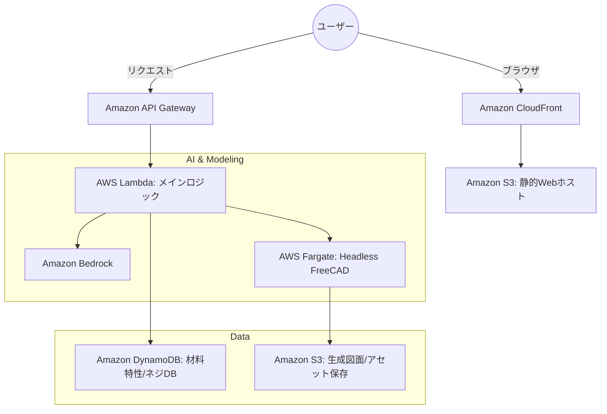
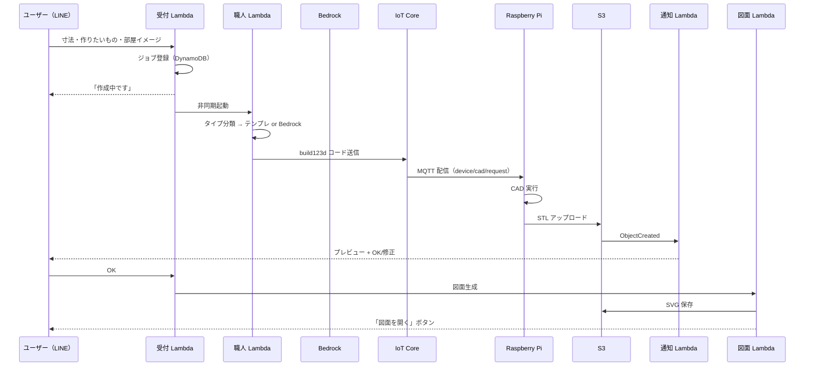

LINE で「かごを作りたい」と送ったら、板が空中にバラバラに浮いた 3D モデルが返ってきました。

原因を追うと、「かご」がキーワード分類にヒットせず Bedrock の自由生成に回り、そこで生成されたコードが build123d に存在しない API を呼んでいた、という話でした。この手の地味な事故を何十回か踏みながら作ったのが **DIY Agent（LINE CAD Bot）** です。

やりたかったことは単純で、スマホから「棚が欲しい」と伝えて、数十秒後に 3D プレビューが届くこと。プロ向けの CAD は高機能すぎるし、DIY でいちばんしんどいのは「頭の中にある形」を CAD に落とす作業だと感じていたからです。

出来上がったのは **LINE Bot × AWS × Raspberry Pi × build123d** という、クラウドとエッジをまたぐ少し変わった構成でした。この記事は、大学 3 年として MVP から少しずつ機能を足していった制作記録です。最初に描いた構想図と実際に動いたものの落差、そして踏んだ地雷を中心に書きます。

> **この記事は v2.0.0（2026 年 7 月）時点の記録です。**
> ユーザー入口は LINE、CAD 実行は自宅の Raspberry Pi 4 でした。その後 v2.1.0 で実行環境を ECS Fargate に、入口を Web に移し、v2.2.0 で LINE Bot 自体をアーカイブしています。現行との差分は末尾の「その後」にまとめました。

---

## 構想図と、実際に動いたものの落差

最初に自分で描いたアーキテクチャは `docs/awsArchitecture/v0.0.0.md` に残しています。CloudFront で Web UI を配り、API Gateway → Lambda を中心に据え、AI は Bedrock、**重い CAD 処理は AWS Fargate 上の Headless FreeCAD**、DynamoDB に材料特性やネジのマスタを持つ、という絵でした。



実際に最初に本番で動かしたのは、この絵のうち **細い 1 本の線だけ**です。

- LINE のテキストを 1 件受け取る
- Bedrock が build123d の Python コードを返す
- AWS IoT Core 経由で自宅の Raspberry Pi に送る
- Pi が STL を生成して S3 に上げる
- ユーザーにプレビュー URL を返す

構想にあった Fargate も材料 DB も入れていません。学生の予算と運用工数を考えて、**計算はエッジの Raspberry Pi に寄せる**判断をしました。「最初から全部作る」のではなく、動く細いパイプラインを先に通して、あとから足していく方針です。

この初期スナップショットは `diy-cad/versions/v1.0.0-production/` に残してあります。

---

## v2.0.0 の構成

そこから会話フロー・物体タイプ分類・完成通知・図面出力まで足したのが v2.0.0 です。



Lambda は 4 本で、役割の名前をそのまま付けています。受付係の `line-diy-cad-webhook` が LINE Webhook を受けて 3 ステップの会話を進めてジョブを登録し、職人係の `line-cad-worker` が物体を分類して CAD コードを作り IoT に publish、通知係の `line-cad-notify` が S3 に STL が来たら LINE で完成を伝え、図面係の `line-cad-drawing` が OK 後に JIS 風 SVG を作る。エッジの Raspberry Pi は MQTT を受けて build123d を回し、S3 に STL を置くだけです。

ユーザーから見た入力は 3 ステップ — **最大許容寸法**（例: 幅30×奥行20×高さ40 cm）、**作りたいもの**（例: 3段式の棚、かご）、**部屋のイメージ**（写真かテキスト）。送信後は「作成中」だけ返し、Pi が STL を上げ終わったタイミングで完成通知が届きます。プレビューを見て OK を押すと図面生成が走ります。

セッションは DynamoDB `line-cad-sessions`、ジョブは `line-cad-jobs`、物体タイプ定義は `line-cad-object-types`。インフラは `diy-cad/` 配下に SAM（`template.yaml`）で置き、リージョンは `ap-northeast-1`、Bedrock モデルは `jp.anthropic.claude-haiku-4-5-20251001-v1:0`（東京 CRIS）です。

技術選定の理由は、ほぼ全部「学生に現実的だから」でした。LINE は日本で一番ハードルが低く部屋の写真も送れる。IoT Core を使えば自宅の Pi を MQTT で叩けるので、常時 HTTP ポーリングが要らない。build123d は FreeCAD 系より軽く Python だけで完結する。構想にあった **Fargate + Headless FreeCAD** を MVP で採用しなかったのも、コストとデバッグのしやすさが理由です。代わりに **「クラウドは指揮、実際の CAD 実行は Pi」** という分担にしました。

---

## 悪戦苦闘の記録

ここからが本題です。動くものになるまで、かなり地味な問題と格闘しました。

### build123d に存在しない API を LLM が書く

Bedrock が返すコードに、Pi で確実に落ちるパターンが何度も出てきました。

```python
# ラズパイで実際に失敗したパターン（いまはプロンプトで禁止している）
# - p.Plane(...) / Plane.XY      … build123d には無い
# - build123d.build()
# - Box(...) * Location(...)     … 順序が逆
# - p.add()                       … 部品結合のつもり
# - p.extrude()                   … BuildSketch 内の extrude() を使う
```

対策として `worker/lambda_function.py` にサニタイズと禁止パターン検証を入れ、プロンプトに実際の失敗例を few-shot で足しました。

それでも 100% は防げません。最終的に、棚・箱・かごなど **分類できる形状はテンプレート生成に切り替える**方針にしました。これがいまの `cad_templates.py` と `object_types.py` です。LLM の出番を減らすのがいちばん確実な品質対策だった、というのがこの時点の結論です。

### 棚が「十字」になる事件

テンプレートで `for` ループを使って棚板を並べた build123d コードを Pi に送ったら、インデントが壊れて **側板だけが実行された**という事故がありました。棚のはずが十字の板になっている。

教訓は単純で、**Pi に送るコードはループを展開し、`with Locations(...): Box(...)` を明示的に書く**こと。生成したコードを別マシンで実行する構成では、コードの見た目の綺麗さより、壊れにくさが優先されます。棚テンプレートはこの反省を直接反映しています。

### 「かご」を頼んだのに板の集合体が出てくる

冒頭の話です。ログを追うと、「かご」はキーワード分類にヒットせず Bedrock の自由生成に回り、禁止 API 入りのコードが Pi で変な形状になっていました。

**basket タイプ**と格子状のかごテンプレートを追加し、図面も **JIS 風 A3 シート**（枠・表題欄・三視図・公差表）で出すようにしました。ユーザーから「まあまあ」と言ってもらえたのは、このあたりまで来てからです。

### 返事が来ない・リンクが開けない

完成通知まわりでは、地味だが致命的なバグが続きました。

| 症状 | 原因 |
|------|------|
| 「作成中」のまま返事がない | 通知 Lambda の `LINE_CHANNEL_ACCESS_TOKEN=""` がコード内フォールバックを潰していた |
| 図面 URL が AccessDenied | 非公開バケットに直リンクを送っていた |
| 署名付き URL が長すぎて開けない | LINE が本文を折りたたみ、タップできない |

3 つ目は LINE 特有で気づきにくいものでした。URL 自体は正しいのに、長すぎて本文が折りたたまれ、ユーザーがタップできない。最終的に、完成通知は S3 イベント → `line-cad-notify` → LINE push、図面は `drawings/*` のみ公開読み取り可にして**短い固定 URL**、そして LINE には URL を本文に貼らず**「図面を開く」ボタン**（テンプレートメッセージ）で送る、という組み合わせに落ち着きました。

### CloudFormation に載っていない Lambda

SAM でデプロイしようとしたら、既存 Lambda と名前が衝突しました。コンソールで先に作ってしまった `line-diy-cad-webhook` と `line-cad-worker` を、CloudFormation の **IMPORT** でスタックに取り込む必要がありました。

「あとから IaC 化する」は想像以上に面倒だと学びました。

### Bedrock の初回利用と予算

Anthropic モデルはユースケース申請が必要で、最初はそこで止まりました。学生アカウントでは月額予算の上限も意識する必要があり、「動いた！」の次に来たのが「課金と権限」でした。

---

## 設計で効いたこと

振り返ると、次の 3 つが効いていました。

**LLM に CAD を任せきりにしない。** 分類できた形状はテンプレート、自由形状だけ Bedrock、というハイブリッドが一番安定しました。

**ジョブテーブルで非同期を明示する。** 受付時に `line-cad-jobs` へ登録し、STL 完成は S3 イベントで通知する形にしたことで、「作成中で止まる」問題の切り分けが楽になりました。この非同期パターンは、後述する Fargate への移行でもそのまま生きます。

**構想と実装のバージョンを分けて残す。** `docs/awsArchitecture/v0.0.0.md`（最初の構想）と `versions/v1.0.0-production/`（初期本番）を別々に置いておいたおかげで、自分がどこまで来たか迷子になりにくかったです。

当時の宿題として書いていたのは、図面の穴・板厚・材料表記の本格化、Pi 側の失敗をクラウドに返して「生成失敗」を明示すること、寸法だけ変えて再生成する修正フロー、IAM も含めた完全 IaC 化、そして構想にあった材料 DB の復活でした。

---

## その後 — v2.1.0 / v2.2.0 で変わったこと

ここまでが v2.0.0（2026 年 7 月）の記録です。この記事を書いたあと、構成はかなり変わりました。**「LINE が入口」「CAD 実行は自宅の Pi」は、いずれも現行ではありません。**

上に書いた宿題は、こうなりました。

| 当時書いたこと | 現在 |
|---|---|
| 図面の穴・板厚・材料表記を本格化 | ✅ 材料リスト（カット寸法 + ホームセンター検索リンク）を図面ページに実装 |
| Pi 側の失敗を「生成失敗」として明示 | ✅ ジョブに `failed` と `error_message` を持たせ、UI から復帰できるように |
| 修正フロー（寸法だけ変えて再生成） | ✅ `POST /jobs/{file}/revise` として実装 |
| SAM で IAM も含めた完全 IaC 化 | ⚠️ ほぼ完了（Worker / Receiver の既存ロールのみ Retain で残置） |
| 材料 DB の段階的な復活 | ⏳ 未着手。カット寸法はテンプレート由来の計算で代替中 |

### v2.1.0 — 実行を Fargate に、入口を Web に

Pi 4 に FreeCAD を載せた結果、複雑な形状で **OOM kill** が頻発しました。CAD 実行を **ECS Fargate Spot（2 vCPU / 4 GiB）の RunTask** に移し、入口も LINE から Amplify 上の Web チャットに移しています。

このとき **Pi 時代の `raspberry-pi/freecad/` のマクロは、そのまま Docker イメージにコピー**しました。「設計で効いたこと」に書いたジョブテーブルの非同期パターンが v1.0 からほぼ無改造で残っていたおかげで、差し替えたのは「誰が STL / PDF をレンダリングするか」だけで済んでいます。オーケストレーションを先に固めておくと、実行基盤は差し替えられる — これが一番の見返りでした。

Pi 経路は消さず、SAM パラメータ `CadBackend=iot` で切り替えられるレガシーとして残しています。

### v2.2.0 — LINE Bot のアーカイブと強度チェック

| 項目 | v2.0.0（本記事） | v2.2.0 |
|---|---|---|
| ユーザー入口 | LINE のみ | Web のみ（`line-diy-cad-webhook` は 410 のスタブ、旧実装は `archive/line-bot/`） |
| 認証 | LINE のユーザー ID | Cognito User Pool `diy-cad-web-users`（Google + メール） |
| Lambda 数 | 4 | 6（+ `line-cad-web-api` / `line-cad-analyze`） |
| CAD 実行 | Raspberry Pi 4 + build123d | Fargate Spot（FreeCAD 1.1.3 + CalculiX + build123d） |
| 成果物 | STL + JIS 風 SVG | + PDF / DXF / 強度チェック（応力分布 SVG・レポート PDF） |
| CAD 品質保証 | なし | 単一連結ソリッド検証 → 不合格なら LLM 再生成リトライ |
| Web 画面 | （なし） | チャット / 図面ビューア / 履歴 / メトリクス / 同意 UI |

冒頭の「かごが板の集合体になる」バグは、v2.2.0 でようやく根本的に潰れました。当時はプロンプトで対処していましたが、**生成された形状が単一の連結ソリッドになっているかを検証し、部品が浮いていたら自動接続を試み、それでもダメなら Bedrock に再生成させる**という段を挟んでいます。プロンプトはお願いですが、検証は保証です。

もう一つ、v2.2.0 で一番危なかったのは FreeCAD のバージョンでした。apt 版 0.19 と gmsh 4.8 の組み合わせで 2 次要素メッシュの受け渡しが壊れており、CalculiX が全要素で `nonpositive jacobian` を返して結果ゼロになる。しかも当時のコードは結果が空だと `max(...) if ... else 0.0` のフォールバックで **「応力 0.0 = 十分な余裕あり」と判定**していました。強度チェックとして最悪の失敗モードなので、公式 AppImage 1.1.3 に差し替えたうえで、**結果が空なら必ず例外を投げる**よう直しています。

いまは `docs/awsArchitecture/v3.0.0-mechanism/concept.md` として、**可動部を持つ機構**（ヒンジ、引き出し、駆動系）への拡張を進めています。部品が分かれたまま出力できる経路と可動範囲チェックが入り、この記事の「単一の塊を作る CAD」からは一歩出ました。

Web 中心になったあとの構成は、別記事「Raspberry Pi 4 で CAD を回していたら OOM で詰んだ」に書いています。

---

## おわりに

このプロジェクトは、「壮大な構想図を描く」ことと「MVP を動かして少しずつ大きくする」ことの両方を、自分で経験した作品です。

面白いのは、**構想図にあって MVP で捨てた Fargate + Headless FreeCAD が、v2.1.0 で本当に必要になって戻ってきた**ことでした。「学生の予算では無理」と一度諦めた選択肢に、要求が育ってから戻る。構想図は実現できなかった絵ではなく、**まだ順番が来ていない絵**だったわけです。

大学 3 年として、クラウド・エッジ・LLM・CAD・LINE を一本の線でつなげられたのは大きな収穫でした。悪戦苦闘の記憶も含めて、それが DIY Agent（LINE CAD Bot）の制作記録です。

---

## 参考リンク

- ソースコード: [usudonsdev/DIY_Agent](https://github.com/usudonsdev/DIY_Agent)
- build123d: https://build123d.readthedocs.io/
- AWS SAM: https://docs.aws.amazon.com/serverless-application-model/
