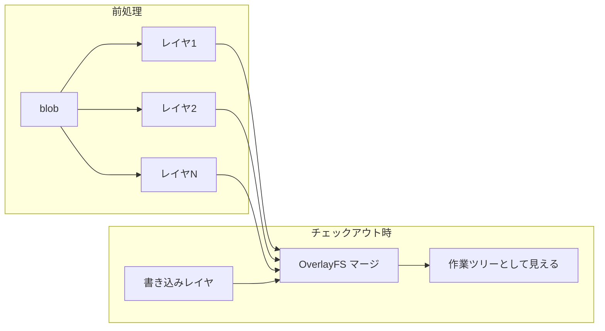
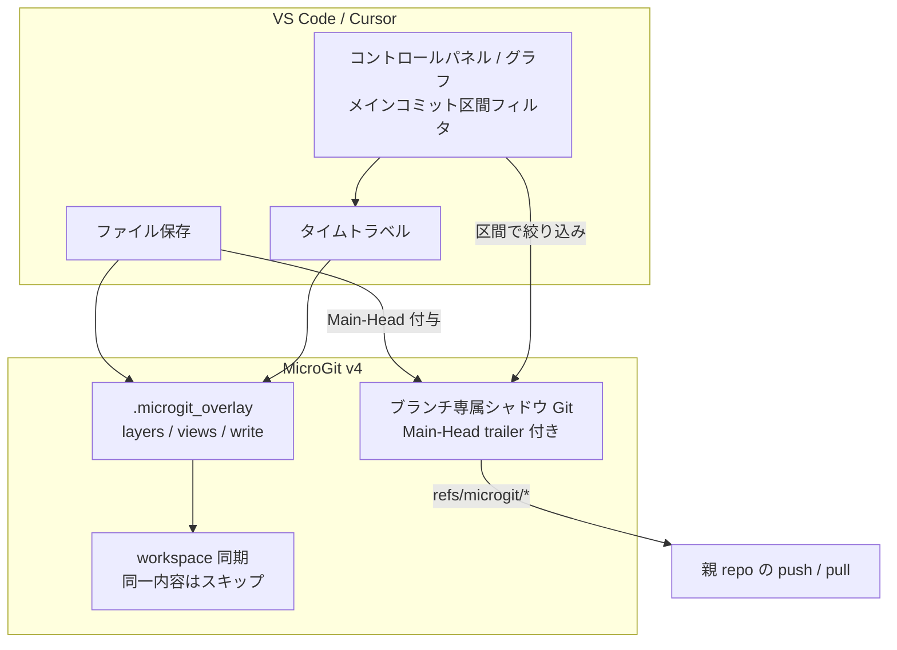

## はじめに

大阪大学・楠本研究室の **OverlayGit**（OverlayFS を用いた高速な Git ファイルシステム）を読んで、「このアイデアを日常の個人開発に持ち込めないか」と考えました。

結果として作ったのが、VS Code / Cursor 拡張の **MicroGit**（本稿時点 **v4.0.0**）です。

- **保存のたびに** マイクロ履歴を自動記録する
- 過去の保存ポイントへ **タイムトラベル** できる
- チェックアウトは Git の blob 展開ではなく、**Overlay 意味論＋展開済みビュー** で高速化する
- 各マイクロコミットに当時のメイン `HEAD`（`Main-Head`）を付け、**メインコミット区間**で履歴を絞り込める

研究そのものの再実装（カーネル OverlayFS マウント）ではなく、**キーアイデアを個人開発ツール向けに再解釈した実装**です。本記事では研究の要点と、MicroGit でどこをどう変えたかを書きます。

- Cursor拡張機能サイト上のページ: [Cursor - microgit](https://open-vsx.org/user-settings/extensions) 
- Vscode拡張機能サイト上のページ: [VScode - microgit](https://marketplace.visualstudio.com/items?itemName=usudonsdev.microgit) 
- リポジトリ: [GitHub — microgit](https://github.com/usudonsdev/microgit)
- 参考研究: 三原・柗本・楠本, [OverlayGit：OverlayFSを用いた高速なGitファイルシステム](https://sdl.ist.osaka-u.ac.jp/pman/pman3.cgi?D=882), 情報処理学会論文誌, 2025

---

## OverlayGit が解こうとしていた問題

Git のチェックアウトが遅い主因は、論文でも指摘されているとおり **blob の展開と作業ツリーの書き換え** です。特に MSR（Mining Software Repositories）では多数リビジョンを行き来するため、このコストが効いてきます。

既存の対抗策には次のようなものがあります。

| 手法 | 利点 | 弱点 |
| --- | --- | --- |
| Scalar 等の部分クローン | 大規模 clone を軽くできる | 全ファイルが必要な MSR には向かない |
| RepoFS（遅延取得） | checkout 自体は速い | 読み取り専用・全体アクセスには不向き |
| worktree 複製 | 切替がほぼ「ディレクトリ移動」 | 空間コストが爆発する |

OverlayGit のキーアイデアは論文の言葉を借りると **「空間的資源を活用した時間計算量の削減」**（空間で時間を買う）です。

1. **前処理**: コミットごとに変更ファイルだけをレイヤへ展開しておく
2. **統合**: OverlayFS でレイヤを重ね、あるリビジョンの作業ツリーを見せる
3. **切替**: マウントするレイヤ集合を変えるだけで checkout する（都度 blob 展開しない）

さらに書き込みレイヤや `.git` レイヤを載せ、読み書き可能な Git ファイルシステムとして MSR 用途に寄せています。論文では Git 比で最大 13 倍程度のチェックアウト高速化が報告されています。



---

## 個人開発に持ち込んだときのギャップ

研究の主戦場は **大規模リポジトリの MSR** です。一方、自分が欲しかったのは次でした。

- Ctrl+Z で消える「数分単位の試行錯誤」を残したい
- 保存のたびにマイクロコミットが欲しい（通常 Git に毎秒コミットはしたくない）
- Windows / macOS / Linux で **同じ拡張機能として動く** 必要がある
- カーネル OverlayFS や fuse-overlayfs のマウント権限に依存したくない

ここが設計の分岐点です。

| 観点 | OverlayGit（研究） | MicroGit（本実装） |
| --- | --- | --- |
| 主用途 | MSR・大量 checkout | 個人開発の超高頻度履歴 |
| ストレージ | 既存 Git + OverlayFS マウント | 既存 Git（シャドウ）+ Node Overlay |
| Overlay 実装 | OS の OverlayFS | **Node.js ユーザー空間**で意味論を再現 |
| 展開方針 | レイヤ統合（マウント） | レイヤ + **展開済みビュー永続化** |
| UI | ファイルシステムとして透過 | サイドバー・グラフ・**メイン区間フィルタ** |
| OS | Linux OverlayFS 前提 | Windows / macOS / Linux 同一経路 |

当初は `mount -t overlay` / fuse も検討しましたが、拡張機能としてポータブルに動かすのが難しく、**OS mount は捨てて Node 一本化**しました。

---

## MicroGit で実装したこと

### 1. 保存＝マイクロ履歴の分岐

有効化はワークスペース単位。名前付きブランチ上での保存が、そのブランチ専属のマイクロ空間に積まれます。通常の `git commit` は使わず、`commit-tree` 系で親を明示して分岐させます（過去へジャンプした状態から保存すると、そこから枝が伸びる）。

ユーザーから見える体験はシンプルです。

1. コントロールパネルで MicroGit を ON
2. `Ctrl+S` するたびに履歴が増える
3. グラフやパネルから過去ポイントへジャンプ（必要なら区間で絞る）

### 2. Node.js ユーザー空間 Overlay


`.microgit_overlay` 以下に OverlayFS 互換の構造を置きます。

| パス | 役割 |
| --- | --- |
| `layers/<hash>/` | コミット差分（変更ファイルの実体 + `.wh.*` whiteout） |
| `views/<hash>/` | そのコミット時点の**完全展開ビュー**（キャッシュ） |
| `write/<mb-*>/` | マイクロブランチごとの書き込みレイヤ |
| `merge/` | ビュー + write を合成した作業用ツリー |

whiteout（`.wh.<name>`）も OverlayFS と同様に扱い、削除をレイヤで表現します。

### 3. 「空間で時間を買う」をビュー永続化で再現

研究ではマウント切替が時間短縮の本体です。MicroGit ではマウントが使えないため、次の形に翻訳しました。

```
保存時:  差分レイヤを書き出し → 親ビュー + レイヤで views/<hash>/ を O(変更) で伸ばす
切替時:  views/<tip>/ が既にあれば再計算しない → write を載せて workspace へ同期
```

再訪問や分岐切替は **キャッシュヒット**、初めて見る先端だけ親ビューから差分適用します。内容が同一のファイルはワークスペースへコピーしません。

核心部分のイメージは次のとおりです（実装は `src/overlay.ts`）。

```typescript
// 親ビューがあれば差分レイヤだけで新ビューを伸ばす
if (parentHash && isViewReady(paths, parentHash)) {
    copyTree(viewDir(paths, parentHash), dest);
    applyLayerOntoMerge(layerDir(paths, commitHash), dest);
    markViewReady(paths, commitHash);
    return 'incremental'; // 切替時にフル再マージしない
}
```

### 4. メインブランチ専属のマイクロ空間と共有

履歴ストアは既存 Git を使いつつ、作業ツリーにネスト `.git` を晒さない形にしています。

- メインの各ブランチごとに専属のマイクロ空間
- 親リポジトリの `refs/microgit/<branch>/*` へ publish
- `Publish` / `Fetch` コマンドで他デバイスと companion 同期

チーム向けライブ同期や PR 自動レビュー連携は将来枠で、現段階は個人開発＋デバイス間共有がスコープです。

### 5. v4.0.0: Main-Head とメインコミット区間フィルタ

保存のたびにマイクロ履歴が増えると、「この通常コミットのあいだに何を試したか」がすぐ埋もれます。v4.0.0 では、各マイクロコミットのメッセージ末尾に当時のメイン `HEAD` を trailer として残します。

```
Main-Head: <フルSHA>
```

パネル／グラフの「メインコミット区間」から、例えば次のように絞り込めます。

| 表示例 | 意味 |
| --- | --- |
| `A → B` | メインが A のあいだに積んだマイクロ履歴 |
| `B → いまの作業` | 最新メインコミット以降の試行錯誤 |
| `すべて（ブランチ全体）` | 区間なし。AI / PR レビュー向けの一本表示 |
| `未分類` | trailer が無い既存コミット（前方互換） |

記録はブランチ単位で一本のまま、**見るときだけ区間で切る**設計です。タイムトラベルの対象は従来どおり「選んだマイクロコミットのツリー全体」です。

既知の制限として、メイン側を amend / rebase して SHA が変わると区間ラベルがずれることがあります。

---

## 全体像



研究の OverlayGit が「Git チェックアウトを OverlayFS で置き換える」なら、MicroGit は「**超高頻度の個人履歴を Overlay 意味論で軽く行き来する**」ための応用です。エンジンは Git、見た目の速さは Overlay（空間で時間を買う）という分担はそのまま踏襲しています。v4 ではさらに、通常 Git のコミット境界とマイクロ履歴を **Main-Head で橋渡し**しています。

---

## 研究との距離感（正直なところ）

- **やったこと**: OverlayFS のレイヤ／whiteout／書き込みレイヤというモデルと、「先に展開して切替を軽くする」という方針の実装
- **やっていないこと**: カーネル OverlayFS マウント、MSR 向け一括前処理、論文と同条件のベンチマーク再現
- **足したもの**: 保存トリガの自動分岐、AI 編集検知（`[AI]`）、Webview グラフ、ブランチ専属空間と refs 共有、**Main-Head＋区間 UI（v4.0.0）**

「論文のツールをそのまま移植した」のではなく、**論文が示したトレードオフを、エディタ拡張の制約の中で取り直した**、という位置づけです。

---

## 使い方（最短）

1. 拡張を入れ、Activity Bar の MicroGit からパネルを開く
2. **Enable** する（ワークスペース単位。記録はそのときいるメインブランチのマイクロ空間へ）
3. 保存するたびに履歴が増える。グラフから過去へジャンプできる
4. 「メインコミット区間」で `A → B` や「いまの作業」に絞る（「すべて」でブランチ全体も可）
5. 他デバイスへ渡すときは `Publish Micro History` → 相手側で pull 後 `Fetch Micro History`

重要なプロジェクトでは、普段どおり通常 Git でコミットしてから使う前提のプロトタイプです。

---

## おわりに

OverlayGit を読んで一番刺さったのは、チェックアウト高速化のテクニックそのものより、**「Git の遅さの正体は blob 展開であり、空間を使えば時間を買える」** という整理でした。

個人開発では MSR ほど巨大なツリーは扱いませんが、「保存のたびに履歴が分岐する」世界では、checkout の軽さがそのまま体験の良し悪しになります。だからこそ Overlay の発想が効きました。v4.0.0 では、その履歴を通常コミットの区間に紐づけて見られるようにし、試行錯誤の「どの作業の途中だったか」も追えるようにしています。

研究に興味がある方は楠本研のページと論文を、ツールとして触ってみたい方はリポジトリや拡張機能ページを見てもらえると嬉しいです。フィードバックや「ここは論文寄りに寄せた方がいい」といった指摘も歓迎です。

---

### 参考文献

1. 三原公平, 柗本真佑, 楠本真二, 「OverlayGit：OverlayFSを用いた高速なGitファイルシステム」, 情報処理学会論文誌, Vol.66, No.11, pp.1462-1472, 2025.
2. 三原公平, 「OverlayFSを用いた効率的なGitチェックアウトの提案 —リポジトリマイニングの高速化を目的として—」, 修士学位論文, 大阪大学, 2025.
