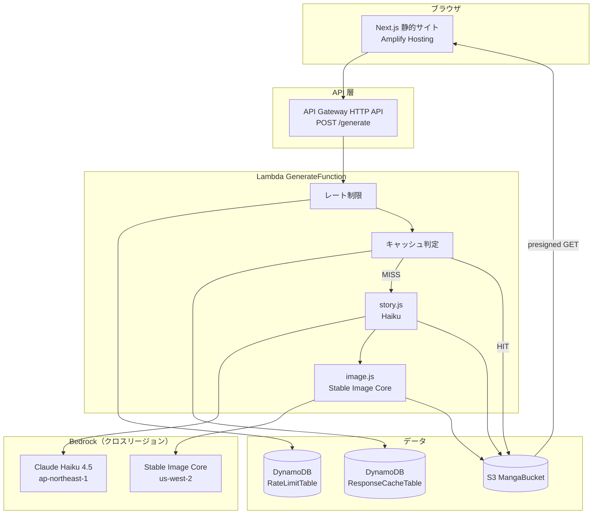
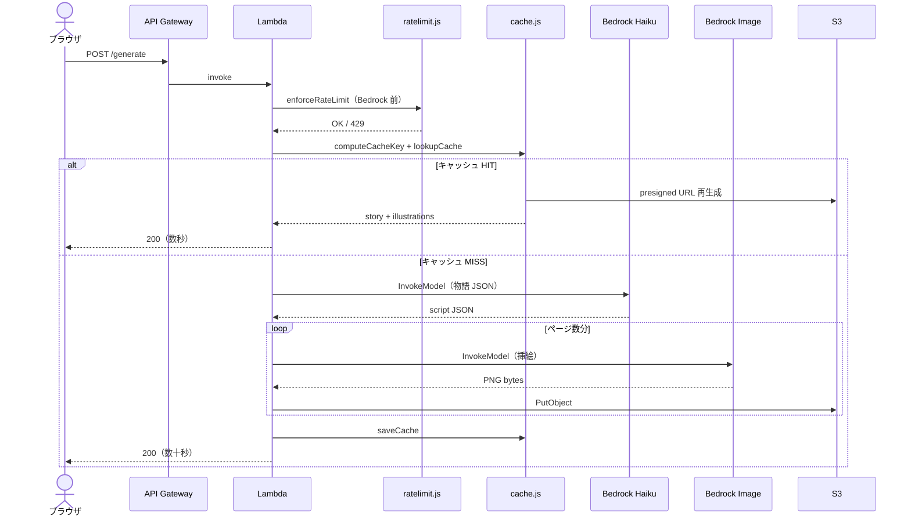

## はじめに

歴史の人物名や理科の公式を入力すると、**ライトノベル形式の学習物語**と**挿絵**が生成される Web アプリを個人開発しました。

- **歴史モード** — 人物・出来事・年号・ものから物語を生成
- **理科 / 数学モード** — 公式・原理・道具から「発見の物語」を生成

ブラウザで入力 → 数十秒待つ → 地の文と会話、各ページの挿絵、末尾の年表が表示されます。

この記事では **AWS 側の構成** と、個人アカウントで **月額約 $5** に収めるために入れた設計（レート制限・キャッシュ・予算ブレーキ）を中心に書きます。

- リポジトリ: [GitHub — story-manga-learn](https://github.com/usudonsdev/story-manga-learn)

---

## 何を作ったか

### ユーザー体験

```
フォーム入力（例: 坂本龍馬 / 大政奉還 / 1867年）
  → POST /generate
  → 物語 JSON + 挿絵 URL が返る
  → ライトノベルビューアで表示
```

1 回の生成で **2 ページ**（既定）の物語と **ページ数と同数の挿絵** が付きます。セリフは UI 側で「」表示、画像には文字を入れません（画像モデルは日本語テキストの誤字が出やすいため）。

### 技術スタック

| レイヤ | 技術 | 役割 |
| --- | --- | --- |
| フロント | Next.js（静的エクスポート）+ Amplify Hosting | UI。Bedrock は直接呼ばず API Gateway 経由 |
| API | API Gateway HTTP API | `POST /generate` |
| バックエンド | Lambda（Node.js 20） | 物語生成 → 挿絵生成 → S3 保存 |
| AI | Bedrock Claude Haiku 4.5 + Stable Image Core | テキスト / 画像 |
| ストレージ | S3 | 挿絵 PNG・story.json（30 日で自動削除） |
| 制御 | DynamoDB × 2 | レート制限カウンター + レスポンスキャッシュ |

認証は入れていません。公開 API なので **コスト暴走を防ぐ仕組み** を先に固めました。

---

## 全体アーキテクチャ



**Fat Lambda 1 本** にまとめています。ジョブの非同期化やポーリングは不要で、1 リクエスト = 1 生成完了の同期レスポンスです。生成に 30〜60 秒かかるため、Lambda タイムアウトは **60 秒**、API Gateway は **29 秒制限** に注意が必要です（キャッシュヒット時は数秒で返ります）。

---

## フロントエンド（Next.js + Amplify）

### 静的エクスポートを選んだ理由

`next.config.ts` で `output: "export"` を指定し、**完全静的サイト** として Amplify Hosting に載せています。

| 方式 | 採用 / 不採用 | 理由 |
| --- | --- | --- |
| 静的エクスポート + Amplify | ✅ 採用 | フロントにサーバー不要。ビルド成果物 `out/` を配信するだけ |
| Next.js SSR（Amplify Web Compute） | ❌ | API は Lambda 側にある。SSR の運用コストが不要 |
| Next.js API Routes で Bedrock 直呼び | ❌ | 秘密情報・レート制限をブラウザ近くに置きたくない |

Amplify のビルドは `amplify.yml` で `npm run build` → `out/` を artifacts に指定。API のベース URL はビルド時環境変数 `NEXT_PUBLIC_API_URL` で埋め込みます。

### 3 モード共通の UI

| コンポーネント | 役割 |
| --- | --- |
| `ModeSwitcher` | 歴史 / 理科 / 数学の切り替え |
| `HistoryForm` / `StemForm` | モード別入力フォーム |
| `LightNovelViewer` | 地の文・会話・挿絵・年表の表示 |
| `MyCollectionPanel` | 生成結果を `localStorage` に保存（サーバー不要） |

コレクションは **クライアントのみ** です。サーバーにユーザー履歴テーブルは作っていません。

---

## リクエストの流れ（初回生成）



**レート制限は Bedrock 呼び出しの前** に実行します。429 のときは AI コスト $0 です。

---

## Bedrock の使い方（クロスリージョン）

### 2 モデル・2 リージョン

| 用途 | モデル | リージョン | 理由 |
| --- | --- | --- | --- |
| 物語・脚本 JSON | Claude Haiku 4.5 | **ap-northeast-1** | 日本向け推論プロファイル、低コスト |
| 挿絵 | Stable Image Core | **us-west-2** | 東京リージョンに Active な画像モデルがない |

Lambda は東京で動き、画像だけオレゴンの Bedrock を呼び出します。`IMAGE_BEDROCK_REGION=us-west-2` で SDK クライアントのリージョンを切り替えています。

### IAM はモデル ARN まで絞る

実行ロールには `bedrock:InvokeModel` を **必要な foundation-model / inference-profile ARN のみ** に限定しています。ワイルドカード `*` で全モデルを許可しないのが、個人開発でも守りたい最小権限です。

```yaml
# sam/template.yaml（抜粋・概念）
- Effect: Allow
  Action: bedrock:InvokeModel
  Resource:
    - arn:aws:bedrock:ap-northeast-1::inference-profile/jp.anthropic.claude-haiku-4-5-...
    - arn:aws:bedrock:us-west-2::foundation-model/stability.stable-image-core-v1:1
```

Anthropic / Stability の初回利用では **AWS Marketplace サブスクリプション** が走ることがあるため、`aws-marketplace:Subscribe` も実行ロールに付けています。

### モデルアクセスは IAM とは別

`bedrock:InvokeModel` が IAM で許可されていても、**コンソールでモデル利用を有効化** していないと失敗します。Haiku（東京）と Stable Image Core（オレゴン）は **別々に** Model catalog + Playground で初回確認が必要でした。

---

## レート制限（2 層構成）

公開 API に認証がない以上、「誰でも POST できる」=「Bedrock 代が膨らむリスク」があります。

| レイヤ | 仕組み | 既定値 | コスト |
| --- | --- | --- | --- |
| **A** | API Gateway スロットリング | burst 10 / 2 req/s | 追加なし |
| **B** | Lambda + DynamoDB カウンター | 20/IP/時、100 全体/時 | 月 $0.01 未満 |

Layer B は `ratelimit.js` が **Bedrock の前** で IP（`X-Forwarded-For`）とグローバル上限をチェックします。DynamoDB は TTL 付きカウンターで、古いウィンドウは自動削除です。

開発者だけ Layer B をバイパスしたい場合は、SAM パラメータ `AdminApiKey` を設定し、リクエストヘッダー `X-Admin-Key` で渡します。**`NEXT_PUBLIC_*` には絶対に載せない** — フッターの管理者設定から `localStorage` に保存する方式にしています。

---

## レスポンスキャッシュ（DynamoDB + S3）

### なぜ必要か

1 回の生成コストは概算 **$0.05〜0.07**（Haiku + 挿絵 2 枚）。学習用途では同じ入力で再生成しがちなので、**同一入力の 2 回目以降は Bedrock を呼ばない** 設計にしました。

### キャッシュキーの作り方

入力フィールドを正規化（trim、空白圧縮、Unicode NFKC）したうえで、モード + 正規化 JSON + `PAGE_COUNT` 等の設定を SHA-256 ハッシュします。

```javascript
// 概念イメージ（cache.js）
function normalizeHistoryInput(history) {
  const fields = ["personNames", "eventNames", "years", "things"];
  // trim → 連続空白を1つ → NFKC
}
```

### ストレージ分担

| 保存先 | 内容 |
| --- | --- |
| DynamoDB `ResponseCacheTable` | キャッシュキー、S3 キー参照、TTL（7 日）、生成ロック |
| S3 `cache/` プレフィックス | story.json、挿絵 PNG |

ヒット時は **DynamoDB 1 読み取り + S3 から presigned URL 再生成** のみ。応答は数秒、AI コスト $0 です。

### 同時リクエストの扱い

同じキーで並行 POST されたとき、**生成ロック** で 1 本だけ Bedrock を走らせ、他は完了待ちまたは 409 を返します。スパイク時の二重課金を防ぐための小さな工夫です。

---

## IAM と予算ブレーキ

個人開発の月額目安は **約 $5（50 生成/月）**。README にコスト内訳を書いたうえで、**AWS Budgets** で上限を監視し、しきい値超過時に **Bedrock だけ止める** 構成も入れています。

### 2 種類の IAM ロールを混同しない

Budgets の「IAM ポリシーを適用」アクションには、ロールが **2 つ** 出てきます。

| 画面の項目 | 選ぶロール | 役割 |
| --- | --- | --- |
| AWS Budgets がアクションを実行するロール | **Budgets 専用サービスロール**（`budgets.amazonaws.com` が Assume） | `iam:AttachRolePolicy` で Deny を付ける |
| ポリシーを適用する対象 | **Lambda 実行ロール** | 実際に `bedrock:InvokeModel` する主体 |

ここを Lambda 実行ロール 1 つで済ませようとすると動きません。Budgets 用ロールは IAM コンソールで **ユースケース「Budgets」** を選んで作成し、マネージドポリシー `AWSBudgetsActionsWithAWSResourceControl` を付けます。

### Deny ポリシーのイメージ

```json
{
  "Version": "2012-10-17",
  "Statement": [
    {
      "Effect": "Deny",
      "Action": [
        "bedrock:InvokeModel",
        "bedrock:InvokeModelWithResponseStream"
      ],
      "Resource": "*"
    }
  ]
}
```

予算の 80% などでこの Deny が Lambda 実行ロールにアタッチされると、**API は動くが生成だけ失敗** します。Lambda / S3 / DynamoDB の小さなコストは残りますが、膨らみやすい Bedrock だけ止まります。

### アラートの例

| しきい値 | 動作 |
| --- | --- |
| 60%（$3） | メール通知のみ |
| 80%（$4） | Deny ポリシー自動適用（推奨: 自動実行「はい」） |
| 100%（$5） | 最終通知 |

`sam deploy` の再デプロイで CloudFormation がロールのポリシーを更新し、Budgets が付けた Deny が外れることがあるので、デプロイ後は Budgets コンソールで状態を確認します。

---

## SAM（IaC）

`sam/template.yaml` 1 ファイルで以下を管理しています。

| リソース | 内容 |
| --- | --- |
| `HttpApi` | CORS、スロットリング |
| `GenerateFunction` | メインハンドラ + Bedrock / S3 ポリシー |
| `MangaBucket` | 暗号化、パブリックブロック、30 日 Lifecycle |
| `RateLimitTable` / `ResponseCacheTable` | PAY_PER_REQUEST + TTL |

```bash
cd sam
sam build
sam deploy --guided
# または parameter_overrides でモデル ID・AdminApiKey を指定
```

デプロイ用 IAM ユーザーには CloudFormation / SAM 用のポリシー（`sam/iam/deploy-policy.json`）を別途付け、**実行ロールは CloudFormation が自動作成** する形にしています。デプロイ権限とランタイム権限を分けることで、本番で動くロールに不要な `cloudformation:*` などが付きません。

---

## コスト感

前提: 月 50 回生成、1 回あたり Haiku + 挿絵 2 枚

| 項目 | 月額目安 |
| --- | --- |
| Bedrock Haiku | $0.5〜1.5 |
| Bedrock Stable Image Core（50 × 2 枚） | 約 $4.0 |
| Lambda / API / S3 / DynamoDB | $1 未満 |
| **合計** | **約 $4〜7** |

キャッシュが効けば AI 部分はさらに下がります。`PAGE_COUNT=4` にすると挿絵枚数が増え、画像コストはほぼ比例して増えます。

---

## うまくいったこと / 反省

### うまくいったこと

- **静的フロント + Lambda API** で責務がはっきり分かれた
- **クロスリージョン Bedrock** を環境変数 1 つで切り替えられる
- **レート制限 → キャッシュ → Bedrock** の順で、高コスト処理の手前にガードを置けた
- **キャッシュ** で再生成の UX とコストの両方を改善
- **Budgets + IAM Deny** で「気づいたら請求が爆発」を抑える最後の砦を用意できた

### 反省・今後

| 項目 | 内容 |
| --- | --- |
| 同期 API | 初回生成 30〜60 秒。キャッシュ MISS 時は API Gateway 29 秒に近づく |
| 認証 | 公開のまま。Cognito や API キーは将来検討 |
| 画像の文字 | AI 画像にセリフを入れない方針。吹き出しは UI テキストのみ |
| 歴史の正確性 | 学習補助用途。ファクトチェックは人間前提 |

ローカル開発では `USE_MOCK=1` で Bedrock を呼ばずモック物語を返せます。フロントも `NEXT_PUBLIC_USE_MOCK=1` で同様です。

---

## まとめ

学習物語メーカーは、次の方針で組み立てました。

1. **フロントは静的、重い処理は Lambda + Bedrock** — 運用をシンプルに
2. **テキストは東京、画像はオレゴン** — リージョン制約を環境変数で吸収
3. **公開 API なのでコスト防衛を先に** — スロットリング、DynamoDB レート制限、キャッシュ、Budgets
4. **IAM はモデル ARN 単位の Allow + 予算超過時の Deny** — 個人アカウントでも再現しやすい型

似たくらいの予算で Bedrock を試す方の参考になれば幸いです。

---

## 参考リンク

- リポジトリ README: [story-manga-learn/README.md](https://github.com/usudonsdev/story-manga-learn/blob/main/README.md)
- キャッシュ設計: [docs/response-cache.md](https://github.com/usudonsdev/story-manga-learn/blob/main/docs/response-cache.md)
- Lambda 実行ロールの整理: [sam/iam/runtime-notes.md](https://github.com/usudonsdev/story-manga-learn/blob/main/sam/iam/runtime-notes.md)
- [Amazon Bedrock Pricing](https://aws.amazon.com/bedrock/pricing/)
- [AWS Budgets アクション](https://docs.aws.amazon.com/cost-management/latest/userguide/budgets-controls.html)

---

## おわりに

「教材っぽい物語を AI で作りたい」という動機から始めて、気づいたら **コスト制御の設計** のほうがボリュームが大きくなりました。個人開発でも公開 API + Bedrock は、機能より先に **レート制限と予算の上限** を決めた方が安心です。

次は年表の表示改善や、理科・数学モードのプロンプト調整を進める予定です。
