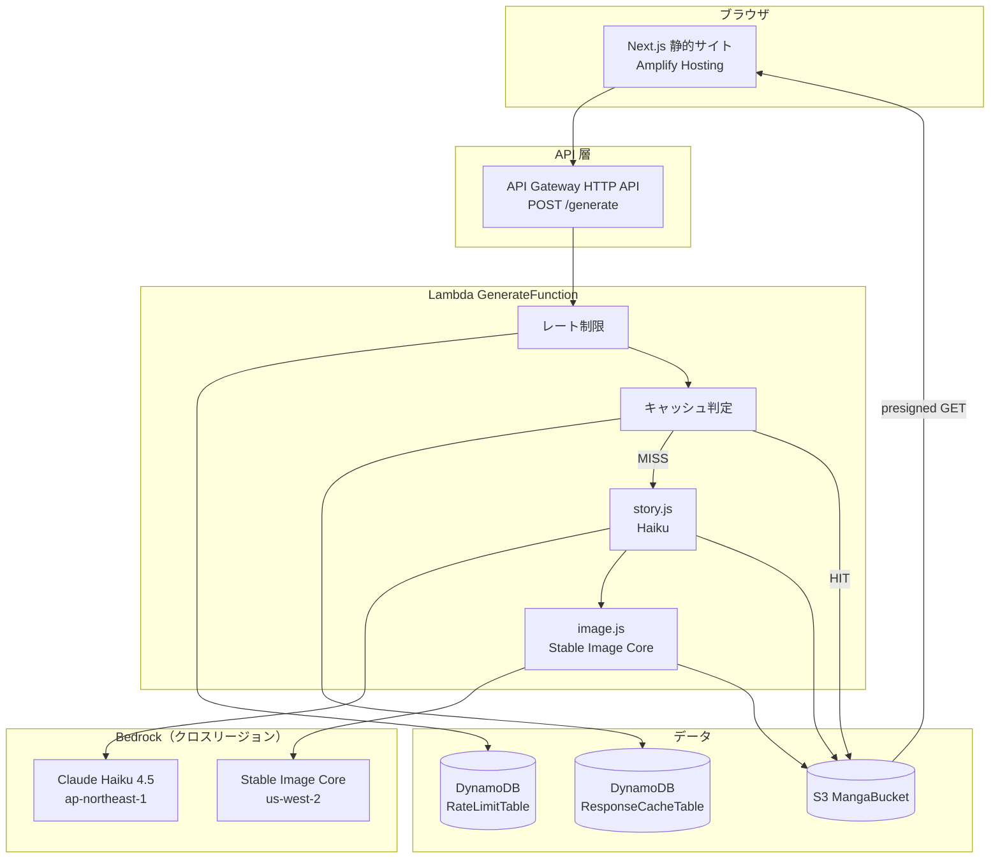
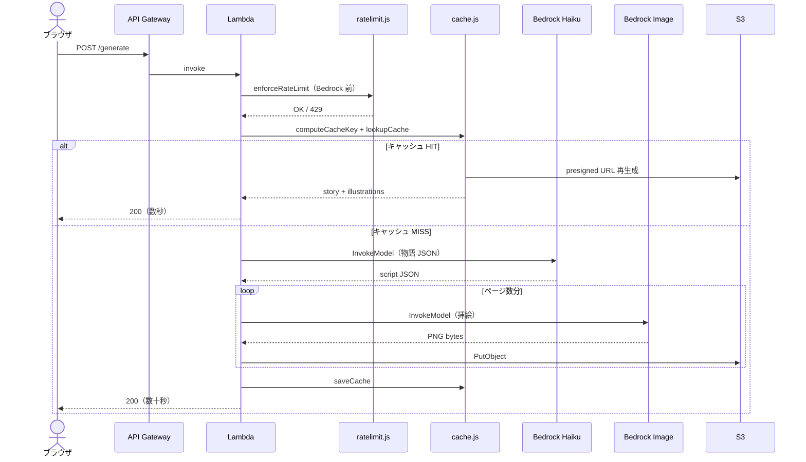

歴史の人物名や理科の公式を入力すると、ライトノベル形式の学習物語と挿絵が生成される Web アプリを作りました。ログインは要りません。誰でもフォームに打ち込めば、裏で Bedrock が走ります。

1 回の生成コストは約 **$0.05〜0.07**。悪意ある誰かが 1 万回叩けば、$500〜700 の請求書が個人アカウントに届きます。

なので、機能より先にコスト防衛を作りました。この記事は **月 $5 を上限に置いた個人開発が、認証なしの公開 API をどう守っているか** の話です。防衛線を 3 枚張って、その後ろに最後の砦を 1 つ置いています。

- リポジトリ: [GitHub — story-manga-learn](https://github.com/usudonsdev/story-manga-learn)

読みどころは後半 2 つです。**API Gateway の 29 秒制限を、非同期ジョブを作らずに越えた話**と、**キャッシュを長生きさせたら画像だけ先に消えた話**（「3 つの寿命は揃えないと壊れる」）。

> この記事は v0.1.0（2026-07-15 執筆）を軸に、同日リリースの v1.0.0 までを時系列で追記しています。見出しに時点を入れてあります。

---

## 何を作ったか

- **歴史モード** — 人物・出来事・年号・ものから物語を生成
- **理科 / 数学モード** — 公式・原理・道具から「発見の物語」を生成

```
フォーム入力（例: 坂本龍馬 / 大政奉還 / 1867年）
  → POST /generate
  → 物語 JSON + 挿絵 URL が返る
  → ライトノベルビューアで表示
```

1 回の生成で 2 ページ（既定）の物語と、ページ数と同数の挿絵が付きます。セリフは UI 側で「」表示にし、**画像には文字を入れません**。画像モデルは日本語テキストの誤字が出やすいので、吹き出しは HTML のテキストとして重ねる方針にしました。

| レイヤ | 技術 | 役割 |
| --- | --- | --- |
| フロント | Next.js（静的エクスポート）+ Amplify Hosting | UI。Bedrock は直接呼ばず API Gateway 経由 |
| API | API Gateway HTTP API | `POST /generate` |
| バックエンド | Lambda（Node.js 20） | 物語生成 → 挿絵生成 → S3 保存 |
| AI | Bedrock Claude Haiku 4.5 + Stable Image Core | テキスト / 画像 |
| ストレージ | S3 | 挿絵 PNG・story.json |
| 制御 | DynamoDB × 2 | レート制限カウンター + レスポンスキャッシュ |

---

## 予算 $5 が構成を決めた


```mermaid
flowchart TB
    subgraph Client["ブラウザ"]
        UI[Next.js 静的サイト<br/>Amplify Hosting]
    end

    subgraph API["API 層"]
        AGW[API Gateway HTTP API<br/>POST /generate]
    end

    subgraph Compute["Lambda GenerateFunction"]
        RL[レート制限]
        CACHE[キャッシュ判定]
        STORY[story.js<br/>Haiku]
        IMG[image.js<br/>Stable Image Core]
    end

    subgraph AI["Bedrock（クロスリージョン）"]
        HAIKU[Claude Haiku 4.5<br/>ap-northeast-1]
        SIC[Stable Image Core<br/>us-west-2]
    end

    subgraph Data["データ"]
        DDB_RL[(DynamoDB<br/>RateLimitTable)]
        DDB_CACHE[(DynamoDB<br/>ResponseCacheTable)]
        S3[(S3 MangaBucket)]
    end

    UI --> AGW
    AGW --> RL
    RL --> DDB_RL
    RL --> CACHE
    CACHE --> DDB_CACHE
    CACHE -->|MISS| STORY
    STORY --> HAIKU
    STORY --> IMG
    IMG --> SIC
    IMG --> S3
    STORY --> S3
    S3 -->|presigned GET| UI
    CACHE -->|HIT| S3
```

**Fat Lambda 1 本**にまとめています。予算が小さいと、部品を増やすこと自体がコストになります。ジョブテーブルもワーカーもキューも置かず、`POST /generate` が返るときには生成が終わっている、という同期の作りにしました。

そのぶん時間の制約は厳しくて、Lambda のタイムアウトは 60 秒、API Gateway HTTP API の統合タイムアウトは **29 秒**。生成には 30〜60 秒かかります。この矛盾は v0.1.0 では放置していて、後半で回収します。

---

## 防衛線を 3 枚、順番に張る

ここが記事の本題です。重要なのは 3 枚あることではなく、**Bedrock を呼ぶ手前に、安いガードから順に並んでいる**ことです。

```
リクエスト
  → [A] API Gateway スロットリング   … 追加コスト $0
  → [B] DynamoDB レート制限           … 月 $0.01 未満
  → [C] キャッシュ判定                 … DynamoDB 1 読み取り
  → Bedrock                            … $0.05〜0.07 / 回
```

止められる場所が早いほど安い。この並びを崩さないことだけを守っています。

### A. API Gateway スロットリング

`POST /generate` に burst 10 / 2 req/s を設定。マネージドなので追加コストはゼロです。総量規制であって「誰が叩いたか」は見ていません。

### B. DynamoDB カウンターで IP ごとに絞る

`ratelimit.js` が **Bedrock 呼び出しの前に** チェックします。既定は 20 リクエスト/IP/時、100 リクエスト/全体/時。IP は `X-Forwarded-For` から取ります。

DynamoDB は TTL 付きのカウンターにしてあるので、古いウィンドウは勝手に消えます。掃除用の Lambda は要りません。月 $0.01 未満です。

**429 を返すとき、AI コストは $0 です。** ここが「Bedrock の前」に置く意味のすべてで、逆に言えば生成の後ろに置いたレート制限には防衛力がありません。

開発中に自分だけバイパスしたいので、SAM パラメータ `AdminApiKey` を設定して `X-Admin-Key` ヘッダーで渡せるようにしています。**`NEXT_PUBLIC_*` に置くと静的ビルドに焼き込まれて全世界に配布される**ので、フッターの管理者設定から `localStorage` に保存する方式にしました。

### C. 同じ入力を 2 度作らない

学習用途では、同じ人物名で何度も生成されます。**同一入力の 2 回目以降は Bedrock を呼ばない** のがいちばん効きました。

キャッシュキーは、入力フィールドを正規化（trim、連続空白を 1 つ、Unicode NFKC）したうえで、モード + 正規化 JSON + `PAGE_COUNT` 等の設定を SHA-256 でハッシュします。

```javascript
// 概念イメージ（cache.js）
function normalizeHistoryInput(history) {
  const fields = ["personNames", "eventNames", "years", "things"];
  // trim → 連続空白を1つ → NFKC
}
```

正規化を入れたのは、「坂本龍馬」と「坂本　龍馬」を別物として課金したくなかったからです。全角空白と半角空白の違いで $0.07 払うのは馬鹿げています。

保存先は 2 つに分けています。DynamoDB `ResponseCacheTable` にキャッシュキー・S3 キーへの参照・TTL・生成ロックを置き、S3 の `cache/` プレフィックスに story.json と挿絵 PNG の実体を置く。ヒット時は **DynamoDB 1 読み取り + S3 の presigned URL 再生成**だけで、応答は数秒、AI コストは $0 です。

### 生成ロック — スパイク時の二重課金を防ぐ

同じキーで並行 POST されると、キャッシュがまだ書かれていないので全部が MISS になり、同じものを何本も生成して課金されます。

`tryAcquireGenerationLock` で **1 本だけ Bedrock を走らせ、他は完了待ちか 409（`GENERATION_IN_PROGRESS`）を返す**ようにしました。Lambda がクラッシュしたときのために、一定時間より古い in-flight ロックは奪い取れるようにしてあります。

この小さな仕組みが、後半で予想外の使われ方をします。

---

## 最後の砦 — Budgets に Bedrock だけ止めさせる

防衛線を 3 枚張っても、想定外は起きます。**AWS Budgets** で上限を監視し、しきい値を超えたら **Lambda 実行ロールに `bedrock:InvokeModel` の Deny を自動アタッチ**する構成を入れました。

```json
{
  "Version": "2012-10-17",
  "Statement": [
    {
      "Effect": "Deny",
      "Action": [
        "bedrock:InvokeModel",
        "bedrock:InvokeModelWithResponseStream"
      ],
      "Resource": "*"
    }
  ]
}
```

Deny が付くと **API は動くが生成だけ失敗する**状態になります。Lambda / S3 / DynamoDB の小さなコストは残りますが、膨らみやすい Bedrock だけが止まる。サイトが 500 を返して真っ白になるより、こちらのほうがまだ説明できます。

| しきい値 | 動作 |
| --- | --- |
| 60%（$3） | メール通知のみ |
| 80%（$4） | Deny ポリシー自動適用（自動実行「はい」） |
| 100%（$5） | 最終通知 |

### ここで詰まる — ロールが 2 つ出てくる

Budgets の「IAM ポリシーを適用」アクションを設定すると、ロールを選ぶ場所が **2 箇所** 出てきます。これを 1 つで済ませようとして動かず、しばらく悩みました。

| 画面の項目 | 選ぶロール | 役割 |
| --- | --- | --- |
| AWS Budgets がアクションを実行するロール | **Budgets 専用サービスロール**（`budgets.amazonaws.com` が Assume） | `iam:AttachRolePolicy` で Deny を付ける側 |
| ポリシーを適用する対象 | **Lambda 実行ロール** | 実際に `bedrock:InvokeModel` する側 |

「ポリシーを付ける主体」と「付けられる客体」で、必要なロールが別なだけの話ですが、画面上はどちらも「ロールを選んでください」に見えます。Budgets 用ロールは IAM コンソールで**ユースケース「Budgets」**を選んで作り、マネージドポリシー `AWSBudgetsActionsWithAWSResourceControl` を付けます。

もう 1 つ落とし穴があって、**`sam deploy` で再デプロイすると CloudFormation がロールのポリシーを更新し、Budgets が付けた Deny が外れることがあります。** 砦が勝手に開くので、デプロイ後は Budgets コンソールで状態を確認するようにしています。

---

## 29 秒の壁を、非同期ジョブを作らずに越える（v1.0.0）

前半で放置した矛盾を回収します。**キャッシュ MISS のとき、この同期 API は完走できません。**

API Gateway HTTP API の統合タイムアウトは約 29 秒。生成には 30〜60 秒かかる。Lambda 側を 60 秒にしても、ブラウザにはゲートウェイのタイムアウトが先に返ります。「1 リクエスト = 1 生成完了」という v0.1.0 の説明は、キャッシュヒット時にしか成り立っていませんでした。

素直に直すならジョブテーブル + ステータス API + ポーリングです。ただ、それは DynamoDB テーブルと状態遷移と、それを管理するコードを増やすということでもあります。

そこで気づいたのが、**必要な部品はもう全部ある**ということでした。生成ロックがあるので、同じキーで再送すれば、走っている生成に相乗りできます。つまり「サーバーは同期のまま、クライアントが再送する」だけでポーリングと同じことが起きる。

```
POST /generate
  ├ 200 + story                  → 完了
  ├ 504 / 503（GW タイムアウト） → 5 秒後に同じ body で再送
  ├ 409 GENERATION_IN_PROGRESS   → retryAfterSeconds を見て再送
  └ 429 / 400 など               → 即エラー表示
```

実装は `src/lib/generate.ts` に閉じています。リトライ対象は `408 / 409 / 425 / 502 / 503 / 504`、ポーリング間隔 5 秒、上限 120 秒。UI には `starting` / `generating` / `waiting` の 3 フェーズを出します。

**結果として、Lambda も DynamoDB テーブルも 1 つも増やさずにポーリングだけを手に入れました。** ジョブ ID もステータス列も導入していません。二重課金を防ぐために置いた生成ロックが、そのまま「待ち合わせ」の仕組みとして使えた、という話です。

コスト防衛のために作った部品が、UX の問題も解いた。設計が小さいと、こういう転用が起きやすいのかもしれません。

---

## 3 つの寿命は揃えないと壊れる（v1.0.0）

もう 1 つ、実際に壊れた話をします。

v0.1.0 の設定はこうでした。

- キャッシュ TTL: **7 日**
- S3 の Lifecycle: 全体を **30 日**で削除
- presigned URL の寿命: **1 時間**

2 日前に生成した物語をキャッシュから引くと、story.json は返ってくるのに **挿絵だけ 403 になります。** キャッシュは生きている、S3 のオブジェクトも生きている、でも URL だけが死んでいる。

3 つの寿命がバラバラだったせいで、**一番わかりにくい壊れ方**をしました。「キャッシュがヒットしているのに中身が出てこない」という症状は、キャッシュを疑ってもストレージを疑っても見つかりません。

直し方は 2 段です。presigned GET の寿命は S3 の上限である 7 日まで延ばし、それでも切れる場合に備えて **`POST /refresh-urls` で取り直せる**ようにしました。フロントのビューアが期限切れを検知して自動で再発行します。

そして保持期間そのものも見直しました。

| 項目 | v0.1.0 | v1.0.0 |
| --- | --- | --- |
| presigned URL | 3600 秒（1 時間） | **604800 秒（7 日 = S3 の上限）** |
| URL の再発行 | なし | **`POST /refresh-urls`** |
| S3 Lifecycle | 全体を 30 日で削除 | `cache/` と `stories/` を**各 365 日**保持 |
| ストレージクラス | 既定（STANDARD） | **INTELLIGENT_TIERING** |
| キャッシュ TTL | 7 日 | **90 日** |

30 日削除はコスト防衛のつもりでしたが、逆効果でした。**キャッシュが効くほど「消えた S3 オブジェクトを指す DynamoDB エントリ」が増える。**

そもそも「$0.05〜0.07 払って生成したものを 30 日で捨てるのが本当に安いのか」を計算し直すと、学習用途では同じ入力が数か月単位で再訪されるほうが支配的でした。PNG 数枚を 1 年寝かせるコストは、1 回の再生成よりはるかに小さい。保持を 365 日に延ばし、代わりにアクセス頻度で自動的に安い階層へ落ちる INTELLIGENT_TIERING に変えました。DynamoDB の TTL も、S3 の寿命より短いと意味がないので 90 日に合わせています。

**キャッシュの寿命・署名 URL の寿命・ストレージの保持期間 — この 3 つは、どれか 1 つだけ短いと最悪の壊れ方をします。** 個別に「これくらいでいいか」と決めたのが間違いでした。

あわせて `AppVersion` を SAM パラメータにして API レスポンスに含め、キャッシュのペイロード形状が変わったら `CACHE_SCHEMA_VERSION`（現在 4）を上げて古いキャッシュを自然に無効化するようにしています。

---

## 設計リファレンス

ここから先は読み飛ばしても筋は通ります。

### フロントエンド（Next.js + Amplify）

`next.config.ts` で `output: "export"` を指定し、完全静的サイトとして Amplify Hosting に載せています。

| 方式 | 採用 / 不採用 | 理由 |
| --- | --- | --- |
| 静的エクスポート + Amplify | ✅ 採用 | フロントにサーバー不要。`out/` を配信するだけ |
| Next.js SSR（Amplify Web Compute） | ❌ | API は Lambda 側にある。SSR の運用コストが不要 |
| Next.js API Routes で Bedrock 直呼び | ❌ | 秘密情報とレート制限をブラウザ近くに置きたくない |

ビルドは `amplify.yml` で `npm run build` → `out/` を artifacts に指定。API のベース URL はビルド時環境変数 `NEXT_PUBLIC_API_URL` で埋め込みます。

UI は `ModeSwitcher`（歴史 / 理科 / 数学の切り替え）、`HistoryForm` / `StemForm`、`LightNovelViewer`（地の文・会話・挿絵・年表）、`MyCollectionPanel`（生成結果を `localStorage` に保存）。コレクションはクライアントのみで、サーバーにユーザー履歴テーブルは作っていません。認証がないので作れない、というのが正確なところです。

### Bedrock — テキストは東京、画像はオレゴン

| 用途 | モデル | リージョン | 理由 |
| --- | --- | --- | --- |
| 物語・脚本 JSON | Claude Haiku 4.5 | **ap-northeast-1** | 日本向け推論プロファイル、低コスト |
| 挿絵 | Stable Image Core | **us-west-2** | 東京リージョンに Active な画像モデルがない |

Lambda は東京で動き、画像だけオレゴンを呼びます。`IMAGE_BEDROCK_REGION=us-west-2` で SDK クライアントのリージョンを切り替えるだけなので、環境変数 1 つでリージョン制約を吸収できています。

実行ロールの `bedrock:InvokeModel` は、必要な foundation-model / inference-profile の ARN のみに限定しています。

```yaml
# sam/template.yaml（抜粋・概念）
- Effect: Allow
  Action: bedrock:InvokeModel
  Resource:
    - arn:aws:bedrock:ap-northeast-1::inference-profile/jp.anthropic.claude-haiku-4-5-...
    - arn:aws:bedrock:us-west-2::foundation-model/stability.stable-image-core-v1:1
```

Anthropic / Stability の初回利用では AWS Marketplace サブスクリプションが走ることがあるため、`aws-marketplace:Subscribe` も付けています。

そして **`bedrock:InvokeModel` が IAM で許可されていても、コンソールでモデル利用を有効化していないと失敗します。** Haiku（東京）と Stable Image Core（オレゴン）は別々に Model catalog + Playground で初回確認が必要でした。IAM を疑って時間を溶かしやすいポイントです。

### リクエストの流れ


```mermaid
sequenceDiagram
    actor U as ブラウザ
    participant AGW as API Gateway
    participant L as Lambda
    participant RL as ratelimit.js
    participant C as cache.js
    participant B1 as Bedrock Haiku
    participant B2 as Bedrock Image
    participant S as S3

    U->>AGW: POST /generate
    AGW->>L: invoke
    L->>RL: enforceRateLimit（Bedrock 前）
    RL-->>L: OK / 429
    L->>C: computeCacheKey + lookupCache
    alt キャッシュ HIT
        C->>S: presigned URL 再生成
        C-->>L: story + illustrations
        L-->>U: 200（数秒）
    else キャッシュ MISS
        L->>B1: InvokeModel（物語 JSON）
        B1-->>L: script JSON
        loop ページ数分
            L->>B2: InvokeModel（挿絵）
            B2-->>L: PNG bytes
            L->>S: PutObject
        end
        L->>C: saveCache
        L-->>U: 200（数十秒）
    end
```

### API

| メソッド | パス | 用途 | 追加 |
| --- | --- | --- | --- |
| POST | `/generate` | 物語 + 挿絵の生成（レート制限・キャッシュ判定込み） | |
| POST | `/refresh-urls` | 期限切れ presigned URL の再発行 | v1.0.0 |

### SAM

`sam/template.yaml` 1 ファイルで、`HttpApi`（CORS・スロットリング）、`GenerateFunction`、`MangaBucket`（暗号化・パブリックブロック・Lifecycle）、`RateLimitTable` / `ResponseCacheTable`（PAY_PER_REQUEST + TTL）を管理しています。

```bash
cd sam
sam build
sam deploy --guided
# または parameter_overrides でモデル ID・AdminApiKey を指定
```

デプロイ用 IAM ユーザーには `sam/iam/deploy-policy.json` を付け、**実行ロールは CloudFormation が自動作成**する形にしています。デプロイ権限とランタイム権限を分けておくと、本番で動くロールに `cloudformation:*` のような不要な権限が付きません。

ローカル開発では `USE_MOCK=1` で Bedrock を呼ばずモック物語を返せます。フロントも `NEXT_PUBLIC_USE_MOCK=1` で同様です。

### コスト感

前提: 月 50 回生成、1 回あたり Haiku + 挿絵 2 枚

| 項目 | 月額目安 |
| --- | --- |
| Bedrock Haiku | $0.5〜1.5 |
| Bedrock Stable Image Core（50 × 2 枚） | 約 $4.0 |
| Lambda / API / S3 / DynamoDB | $1 未満 |
| **合計** | **約 $4〜7** |

上限に置いた $5 を、試算がすでにまたいでいます。だから「超えたら止まる」仕組みが要る、という順番です。キャッシュが効けば AI 部分は下がります。`PAGE_COUNT=4` にすると挿絵枚数が増え、画像コストはほぼ比例して増えます。

---

## 学んだこと

**1. ガードは、高い処理の手前から安い順に並べる**

レート制限 → キャッシュ → Bedrock。この順番だけが防衛力の実体で、同じ仕組みを Bedrock の後ろに置いたら意味がありません。429 を返すときに AI コストが $0 であること、それだけを設計の軸にしました。

**2. 小さく作ると、部品が転用できる**

二重課金を防ぐために置いた生成ロックが、そのまま 29 秒の壁を越えるための待ち合わせになりました。ジョブテーブルを作っていたら、この転用は起きなかったと思います。予算の制約で部品を増やせなかったことが、結果的に効いています。

**3. 寿命は個別に決めない**

キャッシュ TTL・署名 URL・S3 の保持期間を、それぞれ「これくらい」で決めたのが一番高くつきました。**どれか 1 つだけ短いと、キャッシュはヒットするのに中身が出てこないという、一番デバッグしづらい壊れ方をします。** 期限が絡む値は、まとめて 1 枚の表にして決めるべきでした。

残っている宿題もあります。認証は公開のままで、Cognito や API キーは将来の検討。AI 画像にセリフを入れない方針は維持していますが、歴史の正確性は学習補助用途として人間のファクトチェック前提のままです。

「教材っぽい物語を AI で作りたい」という動機で始めて、気づいたらコスト制御の設計のほうがボリュームが大きくなりました。個人開発で公開 API + Bedrock をやるなら、機能より先にレート制限と予算の上限を決めたほうが安心して眠れます。

---

## 参考リンク

- リポジトリ README: [story-manga-learn/README.md](https://github.com/usudonsdev/story-manga-learn/blob/master/README.md)
- キャッシュ設計: [docs/response-cache.md](https://github.com/usudonsdev/story-manga-learn/blob/master/docs/response-cache.md)
- Lambda 実行ロールの整理: [sam/iam/runtime-notes.md](https://github.com/usudonsdev/story-manga-learn/blob/master/sam/iam/runtime-notes.md)
- [Amazon Bedrock Pricing](https://aws.amazon.com/bedrock/pricing/)
- [AWS Budgets アクション](https://docs.aws.amazon.com/cost-management/latest/userguide/budgets-controls.html)
