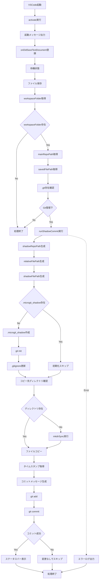

```mermaid
flowchart TD
    A[VSCode起動]
    B[activate実行]
    C[起動メッセージ出力]
    D[onDidSaveTextDocument登録]
    E[待機状態]
    F[ファイル保存]
    G[workspaceFolder取得]
    H{workspaceFolder存在}
    I[処理終了]
    J[mainRepoPath取得]
    K[savedFilePath取得]
    L[.git存在確認]
    M{Git管理下}
    N[runShadowCommit実行]
    O[shadowRepoPath生成]
    P[relativeFilePath生成]
    Q[shadowFilePath生成]
    R{.microgit_shadow存在}
    S[.microgit_shadow作成]
    T[git init]
    U[.gitignore更新]
    V[初期化スキップ]
    W[コピー先ディレクトリ確認]
    X{ディレクトリ存在}
    Y[mkdirSync実行]
    Z[ファイルコピー]
    AA[タイムスタンプ取得]
    AB[コミットメッセージ生成]
    AC[git add]
    AD[git commit]
    AE{コミット成功}
    AF[ステータスバー表示]
    AG[変更なしでスキップ]
    AH[処理終了]
    AI[エラーログ出力]

    A --> B
    B --> C
    C --> D
    D --> E
    E --> F
    F --> G
    G --> H
    H -- No --> I
    H -- Yes --> J
    J --> K
    K --> L
    L --> M
    M -- No --> I
    M -- Yes --> N
    N --> O
    O --> P
    P --> Q
    Q --> R
    R -- No --> S
    S --> T
    T --> U
    R -- Yes --> V
    U --> W
    V --> W
    W --> X
    X -- No --> Y
    X -- Yes --> Z
    Y --> Z
    Z --> AA
    AA --> AB
    AB --> AC
    AC --> AD
    AD --> AE
    AE -- Yes --> AF
    AE -- No --> AG
    AF --> AH
    AG --> AH
    N -. Error .-> AI
    AI --> AH
```